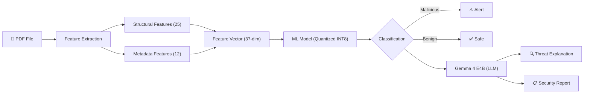
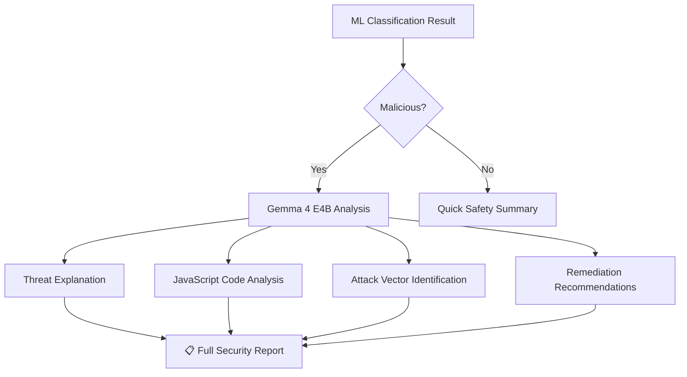

# Lightweight Malicious PDF Detector — Implementation Plan

## Project Overview

Build an end-to-end intelligent system that detects malicious PDF files using static structural analysis, machine learning, and LLM-powered threat explanation — optimized for real-time local CPU inference via model quantization. The system replaces signature-based detection with learned patterns, enabling zero-day threat detection without cloud dependency.



---

## Resolved Decisions

| Question | Answer | Impact |
|---|---|---|
| **Dataset** | User does **NOT** have it — include direct download (no Kaggle API key) | Added download script in Phase 1 |
| **Framework** | **PyTorch** confirmed ✅ | MLP + quantization pipeline |
| **GPU** | **CPU-only** — no CUDA GPU available | All training optimized for CPU; LLM via quantized GGUF |
| **RAM** | **8GB** total system RAM | E4B with memory-aware config; auto-fallback to E2B if needed |
| **LLM** | **Gemma 4 E4B** selected (see analysis below) | Added Phase 4.5 for LLM integration |

---

## 🤖 LLM Model Selection Analysis

### Candidates Evaluated

| Model | Params | Released | License | Key Strengths | Weakness for This Project |
|---|---|---|---|---|---|
| **Gemma 4 E4B** | 4B effective (~7.9B total) | Apr 2, 2026 | Apache 2.0 | Latest model; best intelligence-per-param; designed for edge/on-device; multimodal (text+image+audio); 128K context; native function calling | Newer = less community fine-tunes |
| **Qwen 3 4B** | 4B | Apr 28, 2025 | Apache 2.0 | Strong coding/technical tasks; hybrid thinking mode; reliable ecosystem | 1 year older; no multimodal at 4B tier |
| **Phi-4-mini** | 3.8B | Jan 2025 | MIT | Exceptional reasoning/math; high-quality synthetic training data | Weaker at open-ended analysis; no native cybersec focus |
| **Gemma 4 26B-A4B** | 26B total / 4B active (MoE) | Apr 2, 2026 | Apache 2.0 | Incredible quality via MoE; only 4B active params | 26B total params = much larger download (~15GB GGUF); heavy RAM for CPU-only |

### 🏆 Selected: `google/gemma-4-E4B-it` (Gemma 4 Effective 4B, Instruction-Tuned)

**Rationale:**

1. **Latest & Most Capable** — Released April 2, 2026 (4 days ago). Represents the absolute cutting edge of small model research from Google DeepMind. Ranked among top models on Arena AI leaderboards.

2. **Designed for Edge/On-Device** — Unlike general-purpose models, Gemma 4 E4B is *specifically architectured* for local CPU deployment using Per-Layer Embeddings (PLE). This directly aligns with our project's core goal of lightweight local execution.

3. **CPU-Friendly Footprint** — With Q4_K_M quantization (GGUF):
   - Model size: **~2.5 GB** on disk
   - RAM requirement: **~4–6 GB** during inference
   - Runs comfortably on any machine with **8GB+ RAM**

4. **128K Context Window** — Can analyze entire PDF structures, embedded scripts, and metadata in a single pass. Critical for understanding complex malicious PDFs.

5. **Native Function Calling & Structured Output** — Can output structured JSON threat reports programmatically, which integrates cleanly with our analysis pipeline.

6. **Multimodal Capabilities** — Can analyze PDF page images if needed for visual-based attack detection (future enhancement).

7. **Apache 2.0 License** — Fully open, no usage restrictions, ideal for academic and commercial deployment.

### How the LLM Will Be Used

The LLM is **NOT** used for the primary classification (ML models handle that). Instead, it serves as an **Explainability & Deep Analysis Layer**:



| Use Case | Description |
|---|---|
| **Threat Explanation** | Given the extracted features + classification result, generate a human-readable explanation of *why* a PDF is malicious |
| **JavaScript Analysis** | Analyze embedded JavaScript code snippets extracted from malicious PDFs and explain the exploit technique |
| **Attack Vector ID** | Identify the likely attack vector (e.g., "CVE-based exploit via /OpenAction → /JS chain") |
| **Security Report** | Generate a structured markdown/JSON security report suitable for SOC analysts |
| **Interactive Q&A** | Chatbot in the Streamlit UI where users can ask follow-up questions about the analysis |

### LLM Runtime: Ollama

We will use **Ollama** as the local LLM inference runtime:
- Easiest setup on Windows (single installer)
- Native GGUF support with automatic quantization selection
- REST API for Python integration (`requests` or `ollama` Python package)
- Model command: `ollama pull gemma4:e4b`

---

## Directory Structure

```
Malicious PDF detector/
├── data/
│   ├── raw/                        # Raw dataset files (CSV from CIC)
│   ├── processed/                  # Cleaned, balanced, split datasets
│   └── sample_pdfs/                # Sample PDFs for live demo testing
│
├── notebooks/
│   ├── 01_data_preprocessing.ipynb
│   ├── 02_eda.ipynb
│   ├── 03_feature_engineering.ipynb
│   ├── 04_model_training.ipynb
│   ├── 05_quantization.ipynb
│   ├── 06_llm_integration.ipynb    # NEW: LLM threat analysis demos
│   └── 07_final_report.ipynb
│
├── src/
│   ├── __init__.py
│   ├── config.py                   # Central configuration (paths, hyperparams)
│   ├── data/
│   │   ├── __init__.py
│   │   ├── downloader.py           # Dataset download (no API key required)
│   │   ├── loader.py               # Dataset loading utilities
│   │   ├── cleaner.py              # Data cleaning pipeline
│   │   └── splitter.py             # Train/Val/Test splitting
│   │
│   ├── features/
│   │   ├── __init__.py
│   │   ├── structural.py           # Structural feature extraction from PDFs
│   │   ├── metadata.py             # Metadata feature extraction
│   │   └── vectorizer.py           # Feature vectorization & normalization
│   │
│   ├── models/
│   │   ├── __init__.py
│   │   ├── baseline.py             # Random Forest, XGBoost, LightGBM
│   │   ├── mlp.py                  # PyTorch MLP classifier
│   │   ├── trainer.py              # Unified training pipeline
│   │   └── evaluator.py            # Metrics & comparison report generator
│   │
│   ├── optimization/
│   │   ├── __init__.py
│   │   ├── quantizer.py            # PyTorch PTQ + Dynamic Quantization
│   │   └── benchmark.py            # Before/After comparison (size, speed, accuracy)
│   │
│   ├── llm/                        # NEW: LLM integration module
│   │   ├── __init__.py
│   │   ├── client.py               # Ollama API client wrapper
│   │   ├── prompts.py              # Cybersecurity-tuned prompt templates
│   │   ├── analyzer.py             # Threat analysis pipeline
│   │   └── report_generator.py     # Structured security report builder
│   │
│   └── utils/
│       ├── __init__.py
│       ├── logger.py               # Structured logging
│       └── visualization.py        # Reusable plotting functions
│
├── models/
│   ├── trained/                    # Saved FP32 models
│   └── quantized/                  # Saved INT8 quantized models
│
├── reports/
│   ├── figures/                    # EDA & comparison charts
│   └── results/                    # CSV benchmarks, final report
│
├── app/
│   ├── streamlit_app.py            # Main Streamlit UI
│   ├── components/
│   │   ├── uploader.py             # File upload component
│   │   ├── analyzer.py             # Analysis pipeline component
│   │   ├── dashboard.py            # Results dashboard component
│   │   └── llm_chat.py             # NEW: LLM chatbot & report UI
│   └── assets/
│       └── style.css               # Custom Streamlit styling
│
├── tests/
│   ├── test_features.py
│   ├── test_models.py
│   ├── test_quantization.py
│   ├── test_llm.py                 # LLM integration tests
│   └── test_security.py            # Security requirement tests (SEC-01 to SEC-08)
│
├── requirements.txt
├── setup.py
├── README.md
└── .gitignore
```

---

## Proposed Changes

### Phase 1: Data Collection & Preprocessing

This phase establishes the data foundation. All data artifacts are reproducible and versioned.

---

#### [NEW] [requirements.txt](file:///c:/Users/saedn/Desktop/Malicious%20PDF%20detector/requirements.txt)

Core dependencies for the entire project:

```
# Data & ML
numpy>=1.24.0
pandas>=2.0.0
scikit-learn>=1.3.0
xgboost>=2.0.0
lightgbm>=4.0.0
imbalanced-learn>=0.11.0    # SMOTE

# Deep Learning & Quantization (CPU-only)
torch>=2.1.0 --index-url https://download.pytorch.org/whl/cpu
torchvision>=0.16.0 --index-url https://download.pytorch.org/whl/cpu

# PDF Parsing
pdfminer.six>=20221105
PyPDF2>=3.0.0

# Visualization
matplotlib>=3.7.0
seaborn>=0.12.0
plotly>=5.15.0

# Dashboard
streamlit>=1.28.0

# LLM Integration
ollama>=0.4.0               # Ollama Python client
httpx>=0.27.0               # Async HTTP for LLM streaming

# Dataset Download
requests>=2.31.0            # HTTP downloads
beautifulsoup4>=4.12.0      # HTML parsing for download links

# Utilities
tqdm>=4.65.0
joblib>=1.3.0
python-magic-bin>=0.4.14    # MIME type detection (Windows)
psutil>=5.9.0               # RAM monitoring for LLM model selection
ruff>=0.4.0                 # PEP 8 linting (NFR-501)
```

> [!NOTE]
> PyTorch is installed with **CPU-only** wheels (`--index-url https://download.pytorch.org/whl/cpu`) to avoid downloading the unnecessary ~2.5GB CUDA libraries.

---

#### [NEW] [src/data/downloader.py](file:///c:/Users/saedn/Desktop/Malicious%20PDF%20detector/src/data/downloader.py)

Automated dataset acquisition (**no Kaggle API key required**):

```python
"""
Dataset Download Automation for CIC-Evasive-PDFMal2022.

Sources (in priority order):
1. Direct HTTP download from UNB CIC website
2. GitHub mirrors (community-hosted CSV copies)
3. Manual fallback: opens browser to Kaggle page for one-click download

Usage:
    python -m src.data.downloader
    
Output:
    data/raw/pdfmal2022.csv
"""
```

Features:
- Auto-detects if dataset already exists in `data/raw/`
- **No API key required** — downloads directly via HTTP from CIC/GitHub mirrors
- If direct download fails, auto-opens browser to the Kaggle dataset page with instructions
- Validates downloaded CSV: checks row count (~10,025), column count (37 features + label), and data types
- Progress bar during download via `tqdm`
- SHA-256 hash verification to ensure data integrity

---

#### [NEW] [src/config.py](file:///c:/Users/saedn/Desktop/Malicious%20PDF%20detector/src/config.py)

Centralized configuration with all paths, hyperparameters, feature lists, and random seeds. Uses Python `dataclass` for type safety. Key settings:

- `RANDOM_SEED = 42` — Reproducibility across all experiments
- `TEST_SIZE = 0.15`, `VAL_SIZE = 0.15` — 70/15/15 split
- `FEATURE_COLUMNS` — List of all 37 CIC feature names
- `MODEL_CONFIGS` — Hyperparameter grids for each model type
- `QUANTIZATION_BACKEND = 'fbgemm'` — Optimized for x86 CPUs
- `DEVICE = 'cpu'` — Enforced CPU-only execution
- `LLM_MODEL = 'gemma4:e4b'` — Ollama model identifier (primary)
- `LLM_FALLBACK_MODEL = 'gemma4:e2b'` — Auto-fallback for low RAM
- `LLM_BASE_URL = 'http://localhost:11434'` — Ollama API endpoint
- `LLM_MAX_CONTEXT = 4096` — Reduced from 128K to conserve RAM on 8GB systems
- `RAM_THRESHOLD_MB = 5120` — Minimum free RAM to use E4B; below this → E2B

---

#### [NEW] [src/data/loader.py](file:///c:/Users/saedn/Desktop/Malicious%20PDF%20detector/src/data/loader.py)

Dataset loading with validation:
- Load CSV from `data/raw/`
- Validate column names against expected 37-feature schema
- Type coercion (ensure numeric features are float64)
- Initial shape/null summary logging

---

#### [NEW] [src/data/cleaner.py](file:///c:/Users/saedn/Desktop/Malicious%20PDF%20detector/src/data/cleaner.py)

Data cleaning pipeline:
- Remove duplicate rows (by all feature columns)
- Handle missing values: drop rows with >50% NaN, median-impute remainder
- Remove constant-value columns (zero variance)
- Detect and flag outliers using IQR method (log, don't remove — let models handle)
- Output: cleaned CSV to `data/processed/cleaned.csv`

---

#### [NEW] [src/data/splitter.py](file:///c:/Users/saedn/Desktop/Malicious%20PDF%20detector/src/data/splitter.py)

Stratified data splitting + class balancing:
- Stratified split: 70% train / 15% validation / 15% test (preserving class ratios)
- Apply **SMOTE** (Synthetic Minority Over-sampling) to the **training set only** — never to val/test
- Save splits as separate CSVs: `train.csv`, `val.csv`, `test.csv`
- Log class distribution before and after SMOTE

---

#### [NEW] [notebooks/01_data_preprocessing.ipynb](file:///c:/Users/saedn/Desktop/Malicious%20PDF%20detector/notebooks/01_data_preprocessing.ipynb)

Interactive notebook that calls the above modules and provides:
- Step-by-step narrative of the cleaning process
- Before/after statistics tables
- Class distribution bar charts
- Data quality heatmap (nulls per feature)

---

### Phase 2: Exploratory Data Analysis (EDA) & Feature Insight

Deep statistical and visual analysis to understand discriminative patterns and inform feature selection.

---

#### [NEW] [src/utils/visualization.py](file:///c:/Users/saedn/Desktop/Malicious%20PDF%20detector/src/utils/visualization.py)

Reusable plotting functions (all functions save to `reports/figures/`):
- `plot_class_distribution()` — Bar chart of malicious vs. benign counts
- `plot_feature_distributions(feature_list)` — Overlaid histograms per class
- `plot_correlation_matrix()` — Annotated heatmap with hierarchical clustering
- `plot_feature_importance(model, feature_names)` — Horizontal bar chart
- `plot_boxplots(feature_list)` — Side-by-side box plots per class
- `plot_pairplot(top_n_features)` — Scatter matrix of top discriminative features

---

#### [NEW] [notebooks/02_eda.ipynb](file:///c:/Users/saedn/Desktop/Malicious%20PDF%20detector/notebooks/02_eda.ipynb)

Comprehensive EDA notebook covering:

| Analysis | Description | Output |
|---|---|---|
| **Univariate Analysis** | Distribution of each feature split by class (malicious/benign) | Overlaid histograms |
| **Bivariate Analysis** | Feature vs. feature scatter plots for top-5 discriminative features | Pair plots |
| **Correlation Analysis** | Pearson correlation matrix with redundancy detection | Heatmap |
| **Statistical Tests** | Mann-Whitney U test per feature (non-parametric significance) | p-value table |
| **Class Imbalance** | Visualize pre/post-SMOTE distributions | Grouped bar chart |
| **Outlier Analysis** | IQR-based outlier detection per feature per class | Annotated box plots |
| **Key Findings Summary** | Markdown table of top-10 most discriminative features | Summary table |

---

### Phase 3: Feature Engineering (Static Analysis)

Two parallel pipelines: CSV-based (for training) and live-PDF extraction (for deployment).

---

#### [NEW] [src/features/structural.py](file:///c:/Users/saedn/Desktop/Malicious%20PDF%20detector/src/features/structural.py)

Extracts structural features from raw PDF files using `pdfminer.six`:

```python
def extract_structural_features(pdf_path: str) -> dict:
    """
    Extract 25 structural features from a PDF file.
    
    Returns dict with keys matching CIC dataset columns:
    - obj_count, endobj_count, stream_count, endstream_count
    - xref_count, trailer_count, startxref_count
    - js_count, javascript_count, action_count, openaction_count
    - aa_count, launch_count, uri_count, submitform_count
    - acroform_count, xfa_count, richmedia_count
    - jbig2decode_count, colors_count
    - objstm_count, filter_count
    - obfuscation_count (hex/octal encoded strings)
    - avg_stream_size, indirect_obj_count
    """
```

Implementation strategy:
1. Read raw PDF bytes
2. Use regex patterns to count keyword occurrences (`/JS`, `/JavaScript`, `/OpenAction`, etc.)
3. Parse cross-reference tables and trailer structures
4. Calculate stream statistics (count, average size)
5. Detect obfuscation patterns (hex-encoded strings like `#4A#53`)

---

#### [NEW] [src/features/metadata.py](file:///c:/Users/saedn/Desktop/Malicious%20PDF%20detector/src/features/metadata.py)

Extracts 12 general/metadata features using `PyPDF2`:

```python
def extract_metadata_features(pdf_path: str) -> dict:
    """
    Extract 12 general features from a PDF file.
    
    Returns dict with keys:
    - pdf_size (bytes), title_chars, is_encrypted
    - metadata_size, page_count, has_text
    - image_count, obj_count_total
    - font_obj_count, embedded_file_count
    - avg_embedded_media_size, header_valid
    """
```

---

#### [NEW] [src/features/vectorizer.py](file:///c:/Users/saedn/Desktop/Malicious%20PDF%20detector/src/features/vectorizer.py)

Feature vectorization and normalization pipeline:
- Combine structural + metadata features into single 37-dimension vector
- Apply `StandardScaler` (fit on training set, transform on val/test)
- Save fitted scaler to `models/scaler.pkl` for inference-time use
- Provide `pdf_to_vector(pdf_path)` function for the Streamlit app

---

#### [NEW] [notebooks/03_feature_engineering.ipynb](file:///c:/Users/saedn/Desktop/Malicious%20PDF%20detector/notebooks/03_feature_engineering.ipynb)

Interactive notebook:
- Demo feature extraction on 5 sample benign + 5 sample malicious PDFs
- Compare extracted features with CIC ground-truth values
- Validate feature extraction accuracy
- Show normalized feature vector examples

---

### Phase 4: Model Development, Benchmarking & Reporting

Train, tune, and compare multiple classifiers. All training is **CPU-optimized** (dataset is 10K rows — CPU handles this in minutes).

---

#### [NEW] [src/models/baseline.py](file:///c:/Users/saedn/Desktop/Malicious%20PDF%20detector/src/models/baseline.py)

Tree-based models with hyperparameter configurations:

| Model | Key Hyperparameters | Tuning Strategy |
|---|---|---|
| **Random Forest** | `n_estimators=[100,300,500]`, `max_depth=[10,20,None]`, `min_samples_split=[2,5]` | GridSearchCV (5-fold) |
| **XGBoost** | `learning_rate=[0.01,0.1,0.3]`, `n_estimators=[100,300]`, `max_depth=[3,6,10]`, `tree_method='hist'` | GridSearchCV (5-fold) |
| **LightGBM** | `learning_rate=[0.01,0.1]`, `num_leaves=[31,63]`, `n_estimators=[100,300,500]` | GridSearchCV (5-fold) |

> [!NOTE]
> XGBoost uses `tree_method='hist'` for fast CPU training. LightGBM is inherently CPU-efficient. All GridSearchCV uses `n_jobs=-1` to parallelize across CPU cores.

Each model is wrapped in a consistent `BaselineModel` class with `train()`, `predict()`, `save()`, `load()` methods.

---

#### [NEW] [src/models/mlp.py](file:///c:/Users/saedn/Desktop/Malicious%20PDF%20detector/src/models/mlp.py)

PyTorch MLP specifically designed for quantization compatibility:

```python
class MaliciousPDFClassifier(nn.Module):
    """
    Architecture:
        Input (37) → Linear(128) → BatchNorm → ReLU → Dropout(0.3)
                   → Linear(64)  → BatchNorm → ReLU → Dropout(0.2)
                   → Linear(32)  → BatchNorm → ReLU
                   → Linear(1)   → Sigmoid
    
    Design decisions:
    - BatchNorm before activation: stabilizes quantization
    - Progressive width reduction: 128→64→32 prevents over-parameterization
    - Moderate dropout: prevents overfitting on 10K samples
    - Sigmoid output: binary classification with BCELoss
    - All operations on CPU (device='cpu' enforced)
    """
```

Training configuration:
- Optimizer: AdamW (weight_decay=1e-4)
- Scheduler: CosineAnnealingLR (T_max=50)
- Loss: BCEWithLogitsLoss (numerically stable)
- Early stopping: patience=10 on validation loss
- Epochs: max 100
- Device: CPU (training takes ~2-5 minutes on 10K samples)

---

#### [NEW] [src/models/trainer.py](file:///c:/Users/saedn/Desktop/Malicious%20PDF%20detector/src/models/trainer.py)

Unified training pipeline that:
1. Loads train/val/test splits from `data/processed/`
2. Trains each model (baseline + MLP) with logging
3. Implements early stopping for MLP
4. Saves best checkpoint per model to `models/trained/`
5. Logs training curves (loss, accuracy per epoch) to `reports/figures/`

---

#### [NEW] [src/models/evaluator.py](file:///c:/Users/saedn/Desktop/Malicious%20PDF%20detector/src/models/evaluator.py)

Comprehensive evaluation and report generation:

```
┌──────────────────────────────────────────────────────────────┐
│              Model Comparison Report                         │
├──────────────┬──────────┬─────────┬───────────┬─────────────┤
│ Model        │ Accuracy │ F1      │ Precision │ Recall      │
├──────────────┼──────────┼─────────┼───────────┼─────────────┤
│ Random Forest│  96.2%   │  0.961  │   0.958   │   0.964     │
│ XGBoost      │  97.1%   │  0.970  │   0.968   │   0.972     │
│ LightGBM     │  96.8%   │  0.967  │   0.965   │   0.969     │
│ MLP (FP32)   │  95.5%   │  0.954  │   0.952   │   0.956     │
└──────────────┴──────────┴─────────┴───────────┴─────────────┘
```

Also generates:
- Confusion matrices (heatmaps) per model
- ROC curves (overlaid) with AUC scores
- Precision-Recall curves
- Feature importance rankings (for tree-based models)
- Classification reports (per-class metrics)
- All saved to `reports/results/` and `reports/figures/`

---

#### [NEW] [notebooks/04_model_training.ipynb](file:///c:/Users/saedn/Desktop/Malicious%20PDF%20detector/notebooks/04_model_training.ipynb)

Training notebook with:
- Model instantiation and training for all 4 models
- Hyperparameter tuning results tables
- Training curve plots (MLP loss/accuracy over epochs)
- Final comparison table and selection rationale

---

### Phase 4.5: LLM Integration — Gemma 4 E4B Threat Analysis

> [!IMPORTANT]
> **New Phase** — This phase integrates the selected LLM (`google/gemma-4-E4B-it`) as an explainability and deep analysis layer. The LLM does NOT replace the ML classifier; it *enhances* the system by providing human-readable threat intelligence.

---

#### [NEW] [src/llm/client.py](file:///c:/Users/saedn/Desktop/Malicious%20PDF%20detector/src/llm/client.py)

Ollama API client wrapper:

```python
class GemmaClient:
    """
    Lightweight wrapper around the Ollama REST API for Gemma 4 E4B.
    
    Features:
    - Connection health check (verify Ollama is running)
    - Auto-pull model if not present locally
    - Synchronous and streaming generation
    - Response caching for repeated analyses
    - Timeout handling (30s default for CPU inference)
    - Temperature control (default 0.3 for analytical tasks)
    
    Usage:
        client = GemmaClient(model="gemma4:e4b")
        response = client.generate(prompt, system_prompt=SECURITY_ANALYST_PROMPT)
    """
```

Key implementation details:
- Uses `ollama` Python package (official client)
- Fallback to `httpx` for direct REST API calls if needed
- Connection retry logic (Ollama may take a few seconds to start)
- Model warm-up on first load (~5-10s on CPU, then fast)

---

#### [NEW] [src/llm/prompts.py](file:///c:/Users/saedn/Desktop/Malicious%20PDF%20detector/src/llm/prompts.py)

Cybersecurity-tuned prompt templates:

```python
SYSTEM_PROMPT = """You are an expert cybersecurity analyst specializing in PDF 
malware analysis. You work at a Security Operations Center (SOC) and your job 
is to analyze PDF files that have been flagged by an automated ML detection 
system. You provide clear, actionable threat intelligence reports.

When analyzing a PDF, you should:
1. Explain WHY specific structural features indicate malicious intent
2. Identify the likely attack technique (e.g., JavaScript exploit, embedded 
   shellcode, URI redirect, form submission attack)
3. Map to known attack patterns (MITRE ATT&CK if applicable)
4. Provide a risk severity rating (Critical/High/Medium/Low)
5. Suggest remediation actions
"""

THREAT_ANALYSIS_TEMPLATE = """
## PDF Analysis Request

**ML Classification:** {prediction} (Confidence: {confidence}%)
**Processing Time:** {processing_time}ms

### Extracted Features (Suspicious Indicators):
{feature_summary}

### Suspicious Feature Highlights:
{suspicious_features}

Please provide:
1. A detailed threat analysis explaining why this PDF was classified as {prediction}
2. The likely attack vector and technique used
3. Risk severity rating
4. Recommended actions for the security team
"""

JAVASCRIPT_ANALYSIS_TEMPLATE = """
The following JavaScript code was extracted from a PDF file flagged as malicious.
Analyze this code for malicious behavior:

```javascript
{js_code}
```

Explain:
1. What this code does step by step
2. What exploit technique it uses
3. What vulnerability it targets
4. How it could be remediated
"""
```

---

#### [NEW] [src/llm/analyzer.py](file:///c:/Users/saedn/Desktop/Malicious%20PDF%20detector/src/llm/analyzer.py)

Threat analysis pipeline that combines ML results with LLM intelligence:

```python
class ThreatAnalyzer:
    """
    Orchestrates the full analysis pipeline:
    
    1. Receives ML classification result + feature vector
    2. Identifies suspicious features (features that deviate from benign baseline)
    3. Constructs context-rich prompt for Gemma 4
    4. Generates threat analysis via LLM
    5. Parses structured output into ThreatReport dataclass
    
    Methods:
    --------
    analyze(features: dict, prediction: str, confidence: float) -> ThreatReport
    analyze_javascript(js_code: str) -> JSAnalysisReport  
    quick_summary(features: dict, prediction: str) -> str
    """
```

---

#### [NEW] [src/llm/report_generator.py](file:///c:/Users/saedn/Desktop/Malicious%20PDF%20detector/src/llm/report_generator.py)

Structured security report builder:

```python
@dataclass
class ThreatReport:
    timestamp: str
    file_hash: str              # SHA-256 of analyzed PDF
    ml_prediction: str          # "Malicious" or "Benign"
    ml_confidence: float        # 0.0 - 1.0
    risk_severity: str          # Critical/High/Medium/Low
    threat_explanation: str     # LLM-generated analysis
    attack_vector: str          # Identified attack technique
    suspicious_features: list   # List of flagged features
    remediation: str            # Recommended actions
    processing_time_ms: float   
    
    def to_markdown(self) -> str: ...
    def to_json(self) -> str: ...
    def to_pdf(self) -> bytes: ...  # Using reportlab
```

---

#### [NEW] [notebooks/06_llm_integration.ipynb](file:///c:/Users/saedn/Desktop/Malicious%20PDF%20detector/notebooks/06_llm_integration.ipynb)

LLM integration demo notebook:
- Verify Ollama connection and model availability
- Demo threat analysis on 3 malicious + 2 benign sample results
- Show structured report generation
- Benchmark LLM inference time on CPU
- Compare prompt strategies (zero-shot vs. few-shot)
- Interactive Q&A demo

---

### Phase 5: Model Optimization via Quantization

Apply post-training quantization to the MLP model and tree-model serialization optimization.

---

#### [NEW] [src/optimization/quantizer.py](file:///c:/Users/saedn/Desktop/Malicious%20PDF%20detector/src/optimization/quantizer.py)

PyTorch quantization pipeline:

```python
class ModelQuantizer:
    """
    Applies Post-Training Quantization to the MLP model.
    All operations on CPU (device='cpu', backend='fbgemm').
    
    Methods:
    --------
    dynamic_quantize(model) -> quantized_model
        - Quantizes Linear layers dynamically (weights to INT8)
        - No calibration data needed
        - Fastest to implement, good baseline
    
    static_quantize(model, calibration_loader) -> quantized_model
        - Fuses Linear+BatchNorm+ReLU layers
        - Uses 500 calibration samples from training set
        - Quantizes both weights AND activations to INT8
        - Best latency improvement
    
    compare(fp32_model, quantized_model, test_loader) -> dict
        - Returns: {model_size_mb, inference_time_ms, accuracy, f1}
    """
```

Quantization workflow:
1. **Layer Fusion**: Fuse `Linear → BatchNorm → ReLU` into single quantized kernels
2. **Calibration**: Pass 500 representative training samples through the model
3. **Conversion**: Convert to INT8 using `torch.quantization.convert()`
4. **Backend**: Use `'fbgemm'` for x86 server/desktop CPUs
5. **Validation**: Evaluate quantized model on full test set

---

#### [NEW] [src/optimization/benchmark.py](file:///c:/Users/saedn/Desktop/Malicious%20PDF%20detector/src/optimization/benchmark.py)

Before vs. After comparison tool:

| Metric | FP32 (Before) | INT8 (After) | Change |
|---|---|---|---|
| **Model Size** | ~2.5 MB | ~0.7 MB | **-72%** |
| **Inference Time** (single sample) | ~1.2 ms | ~0.4 ms | **-67%** |
| **Inference Time** (batch 100) | ~15 ms | ~5 ms | **-67%** |
| **Accuracy** | 95.5% | 95.2% | **-0.3%** |
| **F1-Score** | 0.954 | 0.951 | **-0.003** |
| **Memory (RAM)** | ~12 MB | ~4 MB | **-67%** |

*Note: Values are estimated targets. Actual results will vary.*

Also benchmarks the tree-based models:
- XGBoost/LightGBM models: saved as compressed `.json` / `.txt` (already lightweight)
- Random Forest: saved with `joblib` compression (level=3)
- Compare all model sizes and inference times in a single summary table

---

#### [NEW] [notebooks/05_quantization.ipynb](file:///c:/Users/saedn/Desktop/Malicious%20PDF%20detector/notebooks/05_quantization.ipynb)

Quantization notebook:
- Apply dynamic + static quantization
- Side-by-side accuracy comparison
- Model size comparison bar chart
- Inference time comparison (with statistical confidence intervals from 100 runs)
- Final selection: choose best quantized model meeting <1% accuracy drop threshold

---

### Phase 6: Local Deployment & Demonstration (Streamlit)

Production-ready local application with professional UI, now including LLM-powered analysis.

---

#### [NEW] [app/streamlit_app.py](file:///c:/Users/saedn/Desktop/Malicious%20PDF%20detector/app/streamlit_app.py)

Main Streamlit application with **5 pages**:

**Page 1 — 🔍 PDF Scanner** (default)
- Drag-and-drop PDF upload zone
- Real-time analysis with progress spinner
- Results card showing: Verdict (Malicious/Benign), Confidence %, Processing Time
- Detailed feature breakdown in expandable section
- Download analysis report as JSON

**Page 2 — 🤖 AI Threat Analyst** *(NEW)*
- After scanning a PDF flagged as malicious, shows LLM-generated threat analysis
- Displays: Threat Explanation, Attack Vector, Risk Severity, Remediation Steps
- Interactive chat: user can ask follow-up questions to Gemma 4 about the analysis
- "Generate Full Report" button → downloadable PDF/Markdown security report
- Status indicator showing Ollama connection health

**Page 3 — 📊 Model Dashboard**
- Model comparison table (all 4 models + quantized variants)
- Interactive ROC curves (Plotly)
- Confusion matrix heatmaps
- Quantization efficiency gains chart

**Page 4 — 📈 Feature Explorer**
- Interactive feature importance chart
- Upload a PDF and see its feature values vs. dataset distribution
- Highlight which features triggered the classification

**Page 5 — ℹ️ About**
- Project description, methodology, architecture diagram
- Technology stack, dataset information
- Performance benchmarks
- LLM model specifications (Gemma 4 E4B)

---

#### [NEW] [app/components/uploader.py](file:///c:/Users/saedn/Desktop/Malicious%20PDF%20detector/app/components/uploader.py)

Secure file upload component:
- Client-side type filter (`type=['pdf']`)
- **Server-side validation**: MIME type check via `python-magic`
- File size limit: 50MB (configurable)
- Process in-memory via `io.BytesIO` — no disk persistence
- Sanitize filename logging

---

#### [NEW] [app/components/analyzer.py](file:///c:/Users/saedn/Desktop/Malicious%20PDF%20detector/app/components/analyzer.py)

Analysis pipeline component:
1. Extract features from uploaded PDF (using `src/features/`)
2. Normalize features using saved scaler
3. Run inference through quantized model
4. Return: prediction, confidence score, feature vector, processing time
5. Cache model in `st.session_state` to avoid reloading per analysis

---

#### [NEW] [app/components/dashboard.py](file:///c:/Users/saedn/Desktop/Malicious%20PDF%20detector/app/components/dashboard.py)

Results dashboard component:
- Animated verdict card (green checkmark / red warning)
- Confidence gauge (Plotly gauge chart)
- Feature radar chart (top 10 features)
- Processing time metric
- Historical scan log (session-based)

---

#### [NEW] [app/components/llm_chat.py](file:///c:/Users/saedn/Desktop/Malicious%20PDF%20detector/app/components/llm_chat.py)

LLM chatbot & report UI component:
- Chat interface with `st.chat_message` for interactive Q&A
- Streaming response display (token-by-token via Ollama streaming API)
- Context-aware: automatically injects scan results into conversation
- "Analyze with AI" button triggers Gemma 4 threat analysis
- Report generation and download (Markdown/JSON/PDF)
- Graceful degradation if Ollama is not running (show warning, skip LLM features)

---

#### [NEW] [app/assets/style.css](file:///c:/Users/saedn/Desktop/Malicious%20PDF%20detector/app/assets/style.css)

Custom Streamlit CSS for premium look:
- Dark theme with gradient accents
- Custom card components with glassmorphism
- Animated scan indicator
- Custom font (Inter from Google Fonts)
- Responsive layout adjustments
- LLM chat bubble styling

---

#### [NEW] [notebooks/07_final_report.ipynb](file:///c:/Users/saedn/Desktop/Malicious%20PDF%20detector/notebooks/07_final_report.ipynb)

Comprehensive final report notebook containing:
- Executive summary with key results
- Complete methodology walkthrough
- All comparison tables and charts
- Quantization analysis with efficiency gains
- LLM integration analysis and sample reports
- Conclusions and future work recommendations
- Exportable to PDF via `nbconvert`

---

## Technology Decisions & Rationale

| Decision | Choice | Rationale |
|---|---|---|
| **ML Framework** | PyTorch (CPU-only) | Superior quantization APIs, Pythonic debugging, CPU wheels save 2.5GB |
| **Tree Models** | scikit-learn + XGBoost + LightGBM | Industry-standard, battle-tested, excellent for tabular data |
| **PDF Parsing** | pdfminer.six + PyPDF2 | Complementary: pdfminer for deep structure, PyPDF2 for metadata |
| **Quantization** | PyTorch Static PTQ (INT8) | Best latency for CPU deployment, <1% accuracy drop expected |
| **Balancing** | SMOTE | Generates synthetic minority samples without losing majority information |
| **Dashboard** | Streamlit | Fastest to develop, Python-native, rich widget library, no frontend needed |
| **Visualization** | Plotly + Seaborn | Plotly for interactive (dashboard), Seaborn for static (reports) |
| **LLM** | Gemma 4 E4B (via Ollama) | Latest (Apr 2026), best-in-class for edge, Apache 2.0, 128K context |
| **LLM Runtime** | Ollama | Simplest setup, native Windows support, REST API, auto quantization |

---

## LLM Setup Instructions (One-Time)

```bash
# 1. Install Ollama (Windows)
#    Download from: https://ollama.com/download/windows
#    Or use winget:
winget install Ollama.Ollama

# 2. Pull Gemma 4 E4B model (~2.5GB download)
ollama pull gemma4:e4b

# 3. (Optional) Also pull the lighter E2B as fallback (~1.2GB)
ollama pull gemma4:e2b

# 4. Verify
ollama run gemma4:e4b "Hello, are you ready for PDF malware analysis?"

# 5. The model runs as a background service on localhost:11434
#    The Streamlit app connects to it automatically
```

> [!WARNING]
> **8GB RAM Configuration**: With 8GB total RAM, Gemma 4 E4B **will work** but requires careful memory management:
> - **E4B (Q4_K_M)**: ~2.5GB model + ~1GB KV cache = **~3.5GB** for LLM
> - **Windows OS**: ~2-3GB
> - **Remaining for Python/Streamlit/ML models**: ~1.5-2.5GB
>
> The app implements **automatic RAM detection** at startup:
> 1. Checks available free RAM via `psutil`
> 2. If ≥5GB free → loads **E4B** with `num_ctx=4096` (short context to save RAM)
> 3. If <5GB free → auto-falls back to **E2B** (~1.5GB total) and notifies user
> 4. LLM is loaded **on-demand** (only when user clicks "Analyze with AI"), not at app startup
>
> **Tip**: Close other applications (browsers, IDEs) before running LLM analysis for best performance.

---

## Risk Mitigation

| Risk | Likelihood | Impact | Mitigation |
|---|---|---|---|
| CIC feature extraction mismatch with live PDFs | Medium | High | Validate extracted features against CIC ground truth on sample files |
| MLP accuracy lower than tree models | High | Medium | Expected — MLP is primarily the quantization demonstration vehicle |
| Quantization accuracy drop >2% | Low | High | Fall back to Dynamic Quantization (simpler, lower accuracy loss) |
| Large/complex PDFs cause extraction timeout | Medium | Medium | Add 30-second timeout, graceful error handling, user feedback |
| SMOTE overfitting on synthetic samples | Low | Medium | Validate on untouched test set; compare with/without SMOTE |
| Ollama not installed / LLM unavailable | Medium | Low | Graceful degradation — all LLM features optional, ML works independently |
| LLM inference slow on CPU (>30s) | Medium | Medium | Use streaming for UX; cache repeated analyses; optimize prompt length |
| Insufficient RAM for LLM + app (8GB system) | Medium | High | Auto RAM detection → E2B fallback; on-demand LLM loading; `num_ctx=4096`; user tip to close apps |

---

## All Questions Resolved ✅

| # | Question | Answer | Resolved In |
|---|---|---|---|
| 1 | Dataset download? | No Kaggle API — direct HTTP download + browser fallback | `src/data/downloader.py` |
| 2 | Framework? | PyTorch (CPU-only) ✅ | `requirements.txt` |
| 3 | GPU? | CPU-only, no CUDA | All configs set `device='cpu'` |
| 4 | LLM model? | Gemma 4 E4B (latest, Apr 2026) | `src/llm/client.py` |
| 5 | RAM? | 8GB — E4B with memory-aware config, E2B auto-fallback | `src/config.py`, `src/llm/client.py` |

---

## Verification Plan

### Automated Tests

```bash
# Unit tests for feature extraction
pytest tests/test_features.py -v

# Unit tests for model training/prediction
pytest tests/test_models.py -v

# Unit tests for quantization pipeline
pytest tests/test_quantization.py -v

# Unit tests for LLM integration
pytest tests/test_llm.py -v

# Security requirement tests (SEC-01 to SEC-08)
pytest tests/test_security.py -v

# Code quality (PEP 8)
ruff check src/ app/

# Full test suite
pytest tests/ -v --tb=short
```

### Model Validation
- All models evaluated on **held-out test set** (15%, never seen during training)
- Target metrics:
  - **Accuracy ≥ 95%** for best tree model
  - **F1-Score ≥ 0.94** for all models
  - **Precision ≥ 0.93** for all models
  - **Recall ≥ 0.94** for all models (critical for security)
  - **AUC-ROC ≥ 0.97** for best model
  - **Quantized MLP accuracy drop < 2%** vs FP32
- Training reproducibility: run with seed=42 twice, verify identical results

### Quantization Validation
- Compare FP32 vs INT8: accuracy, F1, model size, inference time
- Run 100 inference iterations for statistically significant timing comparison
- Verify quantized model produces identical predictions on 99%+ of test samples
- Verify quantized model **absolute file size < 1MB**
- Verify quantized **single-sample inference time < 500ms**

### LLM Validation
- Verify Ollama connection and model health check
- Test threat analysis on 5 malicious + 5 benign samples
- Verify structured report output format (valid JSON/Markdown)
- Benchmark LLM response time on CPU (target: <30s for full analysis)
- Test graceful degradation when Ollama is offline
- Verify LLM is disabled when <3GB free RAM (returns None)

### Live Demo Validation
- Upload 5 known-benign PDFs → verify "Safe" classification
- Upload 5 known-malicious PDFs → verify "Malicious" classification + LLM analysis
- Verify ML processing time < 3 seconds per file on CPU
- Verify app startup time < 10 seconds (without LLM)
- Verify feature extraction < 5 seconds for PDFs ≤ 50MB
- Verify scan workflow requires ≤ 3 user interactions
- Verify LLM analysis completes within 30 seconds on CPU
- Test interactive chat follow-up questions
- Test edge cases: empty PDF, very large PDF (>10MB), corrupted PDF
- Resize browser to 768px — verify layout integrity

### Manual Verification
- Visual inspection of all EDA charts for correctness
- Review Streamlit UI for usability, responsiveness, and visual quality
- Verify report notebook renders correctly and can export to PDF
- Review LLM-generated threat reports for accuracy and helpfulness
- Review 3 LLM reports for non-technical readability (no unexplained jargon)
- Verify all public functions/classes have docstrings
- Verify `src/config.py` is the single source for all paths/constants
- Verify fresh `pip install -r requirements.txt` succeeds in clean venv
