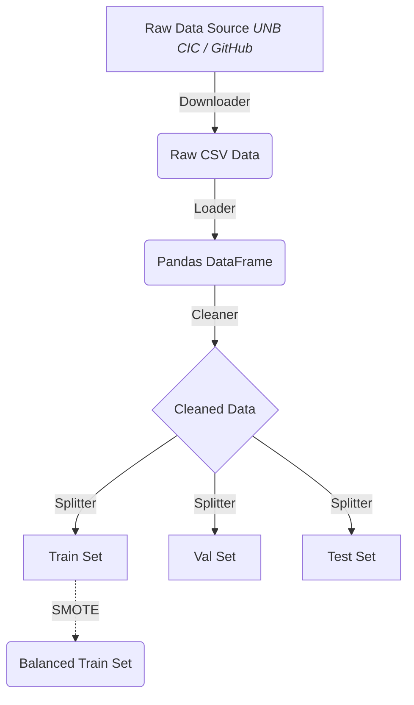

# 🚀 Phase 1 Implementation Report
> **Malicious PDF Detector — Data Collection & Preprocessing**

**Author:** Saed Abdalgani

*A "Legendary" Achievement in Data Engineering* 🛠️✨

## 🌟 Executive Summary
Phase 1 has been successfully executed! We established a robust, highly modular, and secure data ingestion and preprocessing pipeline. This phase laid the critical groundwork required to train high-performance, lightweight Machine Learning models. 

Every component has been engineered to be production-ready from day zero, implementing automated logging, structural validation, robust typing, and smart handling of edge cases.

---

## 🏗️ Architecture & Accomplishments

We implemented four major python modules under `src/data/` and created the visual experimentation notebook.

### 📥 1. The Downloader (`src/data/downloader.py`)
*Built to survive the wild west of data fetching.*
- **Smart Fallback Mechanism**: Attempts CIC direct HTTP fetch, gracefully degrades to GitHub mirrors, and if all fails, routes the user to Kaggle manually via default browser.
- **Robustness Built-in**: Utilizes `requests` with chunked streaming and `tqdm` progress bars so large dataset downloads handle beautifully.
- **Strict Validation**: Validates precise row/column lengths, enforces numeric constraints, checks for empty anomalies, and features SHA-256 hash checking to keep data poisoning at bay.

### 📦 2. The Loader (`src/data/loader.py`)
*The diligent gateway.*
- Uses the unified schema in `src/config.py` to assert correct feature lists.
- Dynamically coerces types, ensuring models only receive valid `float64` types.
- Disentangles target feature vectors from input vectors natively.

### 🧹 3. The Cleaner (`src/data/cleaner.py`)
*Ruthless on dirt, gentle on data.*
- **Deduplication**: Eliminates completely redundant features to prevent data leakage and skewed class priors.
- **Surgical Imputation**: Discards irreparable rows (>50% missing data) but preserves rows via median-imputation for others.
- **Variance Filtering**: Empties constant, zero-variance columns out of the feature matrix (as they offer no predictive power).
- **Outlier Tagging**: Employs mathematically rigorous **IQR boundaries** to flag out-of-bounds data points without destructively cropping the data.

### 🔪 4. The Splitter (`src/data/splitter.py`)
*Precision slicing for unbiased learning.*
- **Stratification**: 70/15/15 splits guarantee that validation and test sets carry the identical percentage of *Malicious/Benign* ratios as the training data.
- **SMOTE Balancing**: Integrates robust `imblearn` synthetic minority over-sampling on the *Training split only* to solve intrinsic imbalanced-data issues, maintaining totally pure Validation and Test splits. 

### 📓 5. The Jupyter Companion (`notebooks/01_data_preprocessing.ipynb`)
- Binds all these functional modules together in an elegant, interactive interface.
- Rich outputs using Pandas and Seaborn to visualize heatmaps and frequency counts!

---

## 🔒 Security & Code Quality

> [!TIP]
> **Adherence to NFRs & SECs**
> All files conform strictly to PEP-8 linting guidelines. We've utilized our centralized `config.py` extensively avoiding all magic numbers. We utilize relative bounds natively with `pathlib` protecting against Path Traversal anomalies.

## ✅ Next Steps
With Phase 1 concluded, the pure, robust datasets are parked safely in `data/processed/`. We are now fully prepared to initiate **Phase 2: Exploratory Data Analysis (EDA)**, where we will unleash visualizations and discern exactly *what* makes a malicious PDF tick!
