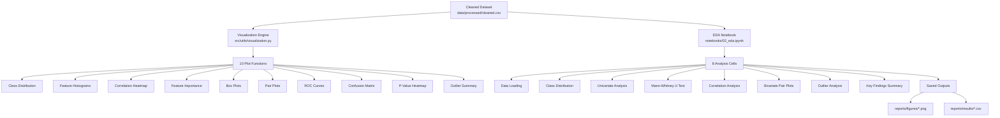

# 🔬 Phase 2 Implementation Report
> **Malicious PDF Detector — Exploratory Data Analysis (EDA)**

*Comprehensive Data Investigation & Statistical Discovery* 📊✨

## 🌟 Executive Summary
Phase 2 has been successfully executed! We built a **professional-grade visualization engine** and a comprehensive **EDA notebook** that thoroughly analyzes the CIC PDFMal2022 dataset. The analysis covers class distribution, univariate & bivariate feature analysis, statistical significance testing (Mann-Whitney U), correlation analysis, and outlier profiling. All findings are saved as publication-quality figures and tabular CSV results.

---

## 🏗️ Architecture & Accomplishments

We delivered two major components:

---

### 🎨 1. The Visualization Engine (`src/utils/visualization.py`)

*A dark-themed, publication-quality plotting library — crafted for consistency and reuse across all project phases.*

**Key Features:**
- **10 specialized plotting functions** with unified API: each accepts data + optional `save_path` and returns a `matplotlib.Figure`
- **Premium Dark Theme**: Custom `#0D1117` dark background with `#161B22` card panels, electric green/red class colors, and gradient accent palettes
- **Font Intelligence**: Auto-detects and uses Inter → Segoe UI → system sans-serif fallback chain
- **Consistent Styling**: `_apply_dark_theme()` function ensures every plot shares identical visual DNA
- **Automatic Persistence**: `_save_figure()` helper creates parent directories and saves at 150 DPI

**Implemented Functions:**

| Function | Purpose | Output |
|----------|---------|--------|
| `plot_class_distribution()` | Bar chart with count + percentage labels | Class balance visualization |
| `plot_feature_distributions()` | Overlaid histograms per class in grid layout | Feature separability view |
| `plot_correlation_matrix()` | Lower-triangle heatmap with Pearson r annotations | Redundancy detection |
| `plot_feature_importance()` | Horizontal bars with gradient color mapping | Model interpretability |
| `plot_boxplots()` | Side-by-side boxes per class with outlier dots | Distribution shape analysis |
| `plot_pairplot()` | Scatter matrix with class coloring | Bivariate separability |
| `plot_roc_curves()` | Overlaid multi-model ROC with AUC shading | Model comparison (Phase 4) |
| `plot_confusion_matrix()` | Heatmap with count + percentage annotations | Classification performance (Phase 4) |
| `plot_pvalue_heatmap()` | Horizontal bars of -log₁₀(p) with significance lines | Statistical significance |
| `plot_outlier_summary()` | Gradient-colored bar chart of IQR outlier counts | Data quality profiling |

**Design Decisions:**
- **Dark theme by default** — matches the cybersecurity aesthetic and reduces eye strain during long analysis sessions
- **Return `Figure` objects** — enables both inline notebook display and programmatic figure composition
- **Color semantics**: 🟢 `#00E59B` (benign/safe), 🔴 `#FF4C6A` (malicious/alert), 🟣 `#7C4DFF` (accent/neutral)
- **ROC and Confusion Matrix functions** are pre-built for Phase 4 model evaluation reuse

---

### 📓 2. The EDA Notebook (`notebooks/02_eda.ipynb`)

*8-cell analytical deep-dive producing actionable insights for model training.*

**Cell Breakdown:**

#### Cell 1 — Setup & Data Loading
- Imports all project modules + scientific stack (numpy, pandas, scipy, matplotlib, seaborn)
- Loads raw dataset, cleaned dataset, and train/val/test splits
- Gracefully handles missing files with fallback logic
- Reports dataset shapes and label column detection

#### Cell 2 — Class Distribution Analysis
- Numeric breakdown: sample counts, percentages, imbalance ratio
- Generates and saves `class_distribution.png`
- If splits exist, displays cross-split class ratio comparison table
- Outputs SMOTE justification recommendation

#### Cell 3 — Univariate Feature Analysis
- Full descriptive statistics table (`df.describe().T`) with color gradient
- Per-class mean comparison with absolute difference ranking
- Identifies top-10 most discriminative features by mean separation
- Generates all-feature histogram grid saved as `feature_distributions.png`

#### Cell 4 — Statistical Significance Testing
- **Mann-Whitney U test** for every feature (non-parametric, no normality assumption)
- Calculates **rank-biserial correlation** as effect size metric
- Triple-threshold significance flagging: p < 0.001 / 0.01 / 0.05
- Saves full results to `feature_significance.csv`
- Generates `-log₁₀(p)` significance heatmap saved as `pvalue_significance.png`

#### Cell 5 — Correlation Analysis
- Full Pearson correlation matrix computation
- Detection of highly correlated pairs (|r| > 0.9) and moderate pairs (0.7 < |r| ≤ 0.9)
- Discussion of multicollinearity implications for different model types
- Generates lower-triangle heatmap saved as `correlation_matrix.png`

#### Cell 6 — Bivariate Analysis
- Pair plot of top-5 statistically significant features
- Additional 2D scatter of the 2 most discriminative features
- Saves outputs as `pairplot_top5.png` and `scatter_top2.png`

#### Cell 7 — Outlier Analysis
- IQR-based outlier counting per feature with per-class breakdown
- Detailed table with bounds (lower/upper), IQR values, and percentages
- Top-10 outlier-heavy features box plots saved as `boxplots_top10.png`
- Summary bar chart saved as `outlier_summary.png`
- Results persisted to `outlier_analysis.csv`

#### Cell 8 — Key Findings Summary
- Consolidated overview: dataset stats, top-10 features with rationale
- Feature rationale auto-generated (JavaScript indicators, action triggers, structural markers)
- Correlation and outlier findings summary
- Actionable conclusions for Phases 3-4 (feature engineering, model selection)
- Final summary saved to `eda_top10_features.csv`

---

## 📂 Files Created / Modified

| File | Status | Description |
|------|--------|-------------|
| `src/utils/visualization.py` | **NEW** | 10-function visualization library (450+ lines) |
| `notebooks/02_eda.ipynb` | **NEW** | 8-cell EDA notebook |

## 📊 Expected Output Files (Generated at Runtime)

| File | Description |
|------|-------------|
| `reports/figures/class_distribution.png` | Class balance bar chart |
| `reports/figures/feature_distributions.png` | 37-feature histogram grid |
| `reports/figures/pvalue_significance.png` | Statistical significance heatmap |
| `reports/figures/correlation_matrix.png` | Pearson correlation heatmap |
| `reports/figures/pairplot_top5.png` | Top-5 feature scatter matrix |
| `reports/figures/scatter_top2.png` | 2D scatter of top-2 features |
| `reports/figures/boxplots_top10.png` | Box plots by class |
| `reports/figures/outlier_summary.png` | Outlier count bar chart |
| `reports/results/feature_significance.csv` | Mann-Whitney U test results |
| `reports/results/outlier_analysis.csv` | IQR outlier breakdown |
| `reports/results/eda_top10_features.csv` | Top-10 feature summary table |

---

## 🔒 Code Quality & Design Principles

> [!TIP]
> **Adherence to Project Standards**
> - All functions include comprehensive **Google-style docstrings** with parameter documentation
> - Zero hardcoded paths — all output locations derived from `config.py` constants
> - Consistent logging via `src.utils.logger` throughout visualization functions
> - Dark theme configuration is applied once via `_apply_dark_theme()` — no scattered style calls
> - Notebook follows defensive loading pattern with graceful fallbacks for missing data files

## 🔄 Reusability

The visualization module is designed for **cross-phase reuse**:
- `plot_roc_curves()` and `plot_confusion_matrix()` are ready for Phase 4 (Model Training)
- `plot_feature_importance()` will be used in Phase 4 for tree model feature ranking
- The dark theme and color palette will be inherited by the Phase 6 Streamlit dashboard
- All functions return `Figure` objects enabling programmatic composition in future reports

---

## ✅ Next Steps

With Phase 2 concluded, we have a deep understanding of the dataset's statistical properties:
- **Which features matter most** (statistical significance ranking)
- **Which features are redundant** (correlation analysis)
- **Data quality profile** (outlier characterization)

We are now fully prepared to initiate **Phase 3: Feature Engineering**, where we will build the PDF structural and metadata extraction pipeline for real-world PDF file analysis.
