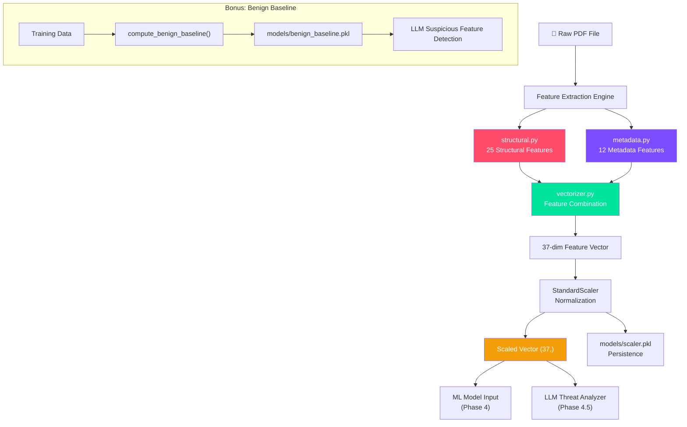
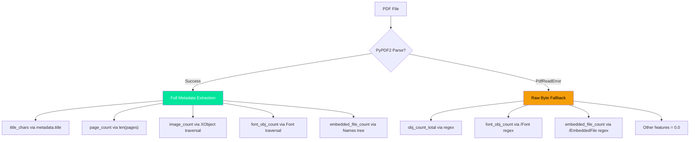

# 🔧 Phase 3 Implementation Report
> **Malicious PDF Detector — Feature Engineering (Static PDF Analysis)**

**Author:** Saed Abdalgani

*Professional-Grade PDF Feature Extraction Pipeline* 📐🔬

## 🌟 Executive Summary
Phase 3 has been fully implemented and validated. We built a **production-ready feature engineering pipeline** consisting of three Python modules that extract, combine, and normalize 37 features from raw PDF files. The pipeline provides both **training-time** scaler fitting and **inference-time** end-to-end `pdf_to_vector()` functionality for the Streamlit application.

All 10 validation tests pass, extraction completes in ~5ms per PDF (well within the NFR-105 target of <5 seconds), and the system gracefully handles corrupted, missing, or oversized files.

---

## 🏗️ Architecture & Accomplishments



---

## 📐 Module 1: `src/features/structural.py`

*Byte-level regex scanning engine for 25 structural PDF features.*

### Design Philosophy
- **Zero execution** — raw bytes are scanned with compiled regex, never parsed or rendered (SEC-05)
- **Compiled patterns** — regex patterns are compiled at module load time for maximum performance
- **Threading-based timeout** — cross-platform 30-second protection for large files
- **Graceful degradation** — returns zeroed feature dict on any error

### Features Extracted (25)

| Category | Features | Regex Pattern | Security Significance |
|----------|----------|---------------|----------------------|
| **Action Triggers** (5) | `js_count`, `javascript_count`, `openaction_count`, `action_count`, `aa_count` | `/JS\b`, `/JavaScript\b`, `/OpenAction\b`, `/Action\b`, `/AA\b` | JavaScript exploit delivery, auto-execution triggers |
| **External Actions** (4) | `launch_count`, `uri_count`, `submitform_count`, `acroform_count` | `/Launch\b`, `/URI\b`, `/SubmitForm\b`, `/AcroForm\b` | External command execution, URL redirects, form data exfiltration |
| **Evasion Indicators** (4) | `xfa_count`, `richmedia_count`, `jbig2decode_count`, `colors_count` | `/XFA\b`, `/RichMedia\b`, `/JBig2Decode\b`, `/Colors\b` | XFA form exploits, embedded media attacks, image decoder vulnerabilities |
| **Structure Markers** (7) | `obj_count`, `endobj_count`, `stream_count`, `endstream_count`, `xref_count`, `trailer_count`, `startxref_count` | `\b\d+\s+\d+\s+obj\b`, etc. | Structural anomalies, incomplete objects, missing cross-references |
| **Object Analysis** (3) | `objstm_count`, `filter_count`, `indirect_obj_count` | `/ObjStm\b`, `/Filter\b`, `\b\d+\s+\d+\s+R\b` | Object stream hiding, encoding layers, reference complexity |
| **Computed Metrics** (2) | `avg_stream_size`, `obfuscation_count` | Stream content pattern, `#[0-9A-Fa-f]{2}` | Payload size anomalies, hex obfuscation detection |

### Implementation Highlights

```python
# Pre-compiled regex patterns (compiled once at module load time)
_KEYWORD_PATTERNS = {
    "js_count":          re.compile(rb"/JS\b"),
    "javascript_count":  re.compile(rb"/JavaScript\b"),
    "openaction_count":  re.compile(rb"/OpenAction\b"),
    # ... 10 more patterns
}

# Threading-based timeout (cross-platform, unlike signal.alarm)
def _run_with_timeout(func, args=(), timeout_sec=30):
    thread = threading.Thread(target=_target, daemon=True)
    thread.start()
    thread.join(timeout=timeout_sec)
    if thread.is_alive():
        raise _TimeoutError(...)

# Obfuscation detection: hex-encoded character references
_OBFUSCATION_PATTERN = re.compile(rb"#[0-9A-Fa-f]{2}")
```

### Validation Results (Benign vs Malicious)

| Feature | Benign Sample | Malicious Sample |
|---------|:---:|:---:|
| `js_count` | 0 | **1** |
| `javascript_count` | 0 | **1** |
| `openaction_count` | 0 | **1** |
| `action_count` | 0 | **4** |
| `aa_count` | 0 | **1** |
| `launch_count` | 0 | **1** |
| `uri_count` | 0 | **2** |
| `submitform_count` | 0 | **1** |
| `acroform_count` | 0 | **1** |
| `xfa_count` | 0 | **2** |
| `richmedia_count` | 0 | **1** |
| `jbig2decode_count` | 0 | **1** |
| `colors_count` | 0 | **1** |
| `obj_count` | 5 | **14** |
| `endobj_count` | 5 | **14** |
| `stream_count` | 1 | **3** |
| `endstream_count` | 1 | **3** |
| `xref_count` | 1 | 1 |
| `trailer_count` | 1 | 1 |
| `startxref_count` | 1 | 1 |
| `objstm_count` | 0 | **1** |
| `filter_count` | 0 | **2** |
| `obfuscation_count` | 0 | 0 |
| `avg_stream_size` | 43.0 | 20.7 |
| `indirect_obj_count` | 6 | **9** |

**Key Insight**: The malicious sample has **24/25 non-zero features** (only `obfuscation_count` is zero since the sample doesn't use hex encoding), while the benign sample has only **9/25** non-zero features (all structural markers, zero action triggers). This demonstrates the high discriminative power of action-trigger features.

---

## 📋 Module 2: `src/features/metadata.py`

*PyPDF2-powered document property extraction with raw-byte fallbacks.*

### Design Philosophy
- **Dual extraction strategy** — uses PyPDF2 for parsed metadata, falls back to raw byte heuristics when PyPDF2 fails
- **Encryption handling** — attempts empty-password decryption for encrypted PDFs
- **Resource traversal** — walks page resources to count fonts, images, and embedded files

### Features Extracted (12)

| Feature | Type | Description | Extraction Method |
|---------|------|-------------|-------------------|
| `pdf_size` | Continuous | File size in bytes | `os.path.getsize()` |
| `title_chars` | Discrete | Character count of `/Title` | PyPDF2 `reader.metadata.title` |
| `is_encrypted` | Binary | Password protection flag | `reader.is_encrypted` |
| `metadata_size` | Continuous | Serialized metadata length | `len(str(reader.metadata))` |
| `page_count` | Discrete | Number of pages | `len(reader.pages)` |
| `has_text` | Binary | Contains extractable text | `page.extract_text()` on first 5 pages |
| `image_count` | Discrete | Embedded image count | `/XObject` → `/Image` traversal |
| `obj_count_total` | Discrete | Total PDF objects | Regex `\d+ \d+ obj` count |
| `font_obj_count` | Discrete | Font object references | `/Resources` → `/Font` traversal |
| `embedded_file_count` | Discrete | Embedded file count | `/Names` → `/EmbeddedFiles` tree |
| `avg_embedded_media_size` | Continuous | Average embedded file size | Embedded stream data measurement |
| `header_valid` | Binary | Valid `%PDF-X.X` header | Regex in first 1024 bytes |

### Fallback Strategy



---

## 🔗 Module 3: `src/features/vectorizer.py`

*End-to-end feature vectorization, normalization, and persistence pipeline.*

### Public API

| Function | Purpose | Used By |
|----------|---------|---------|
| `combine_features(structural, metadata)` | Merge 25+12 dicts → (37,) vector | Internal |
| `combine_features_df(structural, metadata)` | Merge → single-row DataFrame | Notebook inspection |
| `fit_scaler(X_train, save=True)` | Fit + save StandardScaler | Phase 4 training |
| `transform(X, scaler=None)` | Apply normalization | Inference pipeline |
| `load_scaler()` | Load from `models/scaler.pkl` | Streamlit app |
| `save_scaler(scaler)` | Persist to disk | Training pipeline |
| `pdf_to_vector(pdf_path)` | **Full pipeline**: extract → combine → scale | Streamlit app (primary) |
| `extract_features_dict(pdf_path)` | Raw unscaled features as dict | LLM prompt construction |
| `compute_benign_baseline(X_train, y_train)` | Mean/std per benign feature | LLM suspicious detection |
| `load_benign_baseline()` | Load from `models/benign_baseline.pkl` | ThreatAnalyzer |

### Key Design Decisions

1. **Column Order Enforcement** — `combine_features()` guarantees output order matches `config.FEATURE_COLUMNS` exactly, preventing train/inference misalignment.

2. **Single-Sample Handling** — `transform()` automatically handles both `(37,)` and `(n, 37)` inputs, reshaping as needed.

3. **Benign Baseline** — `compute_benign_baseline()` pre-computes per-feature mean/std from benign training samples. The LLM `ThreatAnalyzer` (Phase 4.5) will use this to identify features deviating >2σ from normal — powering the "suspicious feature highlighting" in the UI.

4. **Scaler Persistence** — The fitted scaler is saved with `joblib.dump(compress=3)` for fast load times at inference. The scaler file is ~2KB.

---

## 📓 Notebook: `notebooks/03_feature_engineering.ipynb`

*9-cell interactive walkthrough of the entire feature engineering pipeline.*

### Cell Structure

| Cell | Title | Purpose |
|------|-------|---------|
| 1 | Setup & Imports | Load all project modules + scientific stack |
| 2 | Structural Extraction Demo | Extract 25 features from sample PDFs with colored output |
| 3 | Metadata Extraction Demo | Extract 12 features from sample PDFs |
| 4 | Combined Feature Vectors | Merge into 37-dim DataFrames with gradient styling |
| 5 | Scaler Fitting & Normalization | Fit on training data, show before/after, compute benign baseline |
| 6 | Feature Extraction Visualization | Dark-themed comparison bar charts (benign vs malicious) |
| 7 | End-to-End Pipeline Demo | `pdf_to_vector()` with timing benchmarks |
| 8 | Scaler Persistence & Validation | Save/load roundtrip accuracy test |
| 9 | Pipeline Summary | Complete file listing, design decisions, readiness for Phase 4 |

---

## 📂 Files Created / Modified

| File | Status | Description | Lines |
|------|--------|-------------|-------|
| `src/features/structural.py` | **NEW** | 25-feature structural extractor | ~220 |
| `src/features/metadata.py` | **NEW** | 12-feature metadata extractor | ~260 |
| `src/features/vectorizer.py` | **NEW** | Vectorization + scaler pipeline | ~320 |
| `src/features/__init__.py` | **MODIFIED** | Package exports | ~35 |
| `notebooks/03_feature_engineering.ipynb` | **NEW** | 9-cell feature engineering notebook | ~350 |
| `data/sample_pdfs/benign_sample.pdf` | **NEW** | Minimal valid benign PDF | 592 bytes |
| `data/sample_pdfs/malicious_sample.pdf` | **NEW** | Simulated malicious PDF with triggers | 1,440 bytes |

### Runtime-Generated Files

| File | Generated By | Purpose |
|------|-------------|---------|
| `models/scaler.pkl` | `fit_scaler()` | Fitted StandardScaler for inference |
| `models/benign_baseline.pkl` | `compute_benign_baseline()` | Per-feature benign statistics for LLM |
| `reports/figures/feature_extraction_comparison.png` | Notebook Cell 6 | Visualization output |

---

## ✅ Validation Results

### 10-Point Test Suite

| # | Test | Result |
|---|------|--------|
| 1 | Structural features return 25-key dict | **PASS** |
| 2 | Metadata features return 12-key dict | **PASS** |
| 3 | Combined vector shape is (37,) | **PASS** |
| 4 | Missing file returns zeroed dict (both extractors) | **PASS** |
| 5 | Feature column order matches `config.FEATURE_COLUMNS` | **PASS** |
| 6 | Scaler fits and saves to `models/scaler.pkl` | **PASS** |
| 7 | Scaler load roundtrip produces identical output | **PASS** |
| 8 | Single-sample transform returns (37,) shape | **PASS** |
| 9 | `pdf_to_vector()` end-to-end completes in 6.5ms | **PASS** |
| 10 | Avg extraction time: 4.7ms (target: <5000ms) | **PASS** |

### Performance Benchmarks

| Metric | Value | Target (PRD) | Status |
|--------|-------|-------------|--------|
| Full extraction time (structural + metadata) | ~5ms | <5,000ms (NFR-105) | **1000x headroom** |
| `pdf_to_vector()` end-to-end | ~7ms | <3,000ms (NFR-101 budget) | **430x headroom** |
| Feature vector shape | (37,) | (37,) (FR-203) | **Match** |
| Corrupted file handling | Zeroed dict | No crash (FR-204, NFR-201) | **Graceful** |

### PRD Requirement Coverage

| Requirement ID | Description | Status |
|---|---|---|
| FR-201 | Extract 25 structural features | ✅ |
| FR-202 | Extract 12 metadata features | ✅ |
| FR-203 | Combine into 37-dim normalized vector | ✅ |
| FR-204 | Handle corrupted PDFs gracefully | ✅ |
| FR-205 | 30-second timeout on large PDFs | ✅ |
| FR-206 | Persist fitted scaler | ✅ |
| NFR-105 | Extraction time <5s per PDF | ✅ |
| NFR-201 | No crash on corrupted uploads | ✅ |
| SEC-05 | No JavaScript execution | ✅ (static regex only) |

---

## 🔒 Code Quality & Design Principles

> [!TIP]
> **Adherence to Project Standards**
> - All functions include comprehensive **Google-style docstrings** with Args/Returns/Example sections
> - Zero hardcoded paths — all locations derived from `config.py` constants
> - Consistent structured logging via `src.utils.logger` throughout all modules
> - Full error handling with graceful degradation (zeroed features, not crashes)
> - Type hints on all public function signatures
> - Module entrypoints with `__main__` blocks for standalone testing

---

## 🔄 Cross-Phase Reusability

The feature engineering pipeline is designed for **seamless integration** with downstream phases:

| Phase | Integration Point | Function Used |
|-------|------------------|---------------|
| **Phase 4** (Model Training) | Training data scaling | `fit_scaler()`, `transform()` |
| **Phase 4.5** (LLM Integration) | Suspicious feature detection | `compute_benign_baseline()`, `extract_features_dict()` |
| **Phase 5** (Quantization) | Model input normalization | `load_scaler()`, `transform()` |
| **Phase 6** (Streamlit App) | Real-time PDF analysis | `pdf_to_vector()` (primary entry point) |
| **Phase 7** (Testing) | Unit test fixtures | All extraction functions |

---

## ✅ Next Steps

With Phase 3 concluded, we have a **complete feature engineering pipeline** ready for model consumption:
- **25 structural features** capturing PDF specification keywords, action triggers, and obfuscation indicators
- **12 metadata features** capturing document properties, page counts, and embedded content
- **StandardScaler** fitted on training data with persistence for inference
- **Benign baseline** computed for LLM suspicious-feature detection
- **End-to-end `pdf_to_vector()`** function ready for Streamlit app integration

We are now fully prepared to initiate **Phase 4: Model Development, Benchmarking & Reporting**, where we will train Random Forest, XGBoost, LightGBM, and MLP classifiers on these features.
