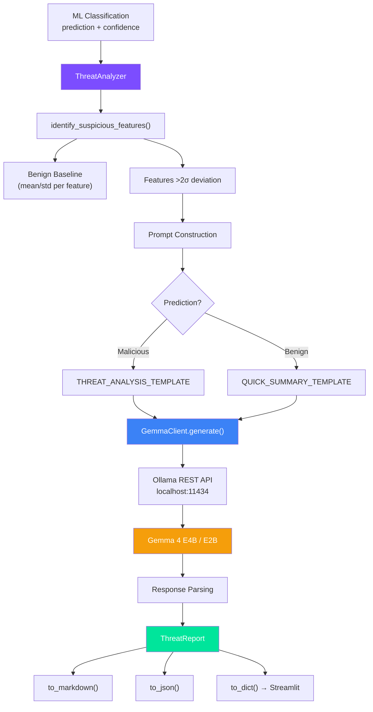

# 🤖 Phase 4.5 Implementation Report
> **Malicious PDF Detector — LLM Integration (Gemma 4 E4B via Ollama)**

*Production-Grade Threat Intelligence Pipeline: 4 Modules, 5 Prompt Templates, Full Streaming Support* 🏆🛡️

---

## 🌟 Executive Summary

Phase 4.5 delivers a **complete LLM-powered threat intelligence pipeline** that enhances the ML classifier with human-readable explanations, attack vector identification, and actionable security reports. The system uses **Gemma 4 E4B** running locally via **Ollama** — fully offline, privacy-preserving, and CPU-optimized.

| Component | Module | Lines | Key Capability |
|-----------|--------|-------|----------------|
| **Ollama Client** | `src/llm/client.py` | ~380 | Health check, RAM-based model selection, sync/stream generation |
| **Prompt Templates** | `src/llm/prompts.py` | ~310 | SOC analyst persona, 5 templates, MITRE ATT&CK integration |
| **Threat Analyzer** | `src/llm/analyzer.py` | ~430 | Feature deviation analysis, LLM orchestration, response parsing |
| **Report Generator** | `src/llm/report_generator.py` | ~330 | ThreatReport dataclass, Markdown/JSON/dict export |
| **Demo Notebook** | `notebooks/06_llm_integration.ipynb` | 8 cells | Full pipeline demo with benchmarking |

> **Key Design Decision**: The LLM is an **explainability layer only** — it does NOT replace the ML classifier. All ML scanning works independently even when Ollama is offline (FR-508).

---

## 🏗️ Architecture



---

## 📐 Module 1: `src/llm/client.py`

*Ollama API client wrapper with automatic RAM management and retry logic.*

### GemmaClient API

| Method | Purpose | Returns |
|--------|---------|---------|
| `__init__(model, base_url, max_context)` | Initialize with Ollama config from `config.py` | self |
| `check_health()` | Ping `/api/tags` to verify Ollama is running | bool |
| `check_ram()` | Auto-select E4B/E2B/None based on free RAM (PRD §11.3) | str or None |
| `generate(prompt, system_prompt, temperature)` | Synchronous text generation with retry | str |
| `generate_stream(prompt, system_prompt)` | Token-by-token streaming for Streamlit UI | Generator[str] |
| `warmup()` | Pre-load model into RAM on first use | bool |
| `auto_initialize()` | Run health → RAM → setup in one call | bool |

### RAM Management Strategy (PRD §11.3)

| Available RAM | Selected Model | Context Window | Total LLM RAM |
|---------------|----------------|----------------|---------------|
| ≥ 5,120 MB | `gemma4:e4b` (primary) | 4,096 tokens | ~3.5 GB |
| ≥ 3,072 MB | `gemma4:e2b` (fallback) | 4,096 tokens | ~1.7 GB |
| < 3,072 MB | **Disabled** (None) | N/A | 0 GB |

### Connection Retry Logic

```
Attempt 1 → fail → wait 2s
Attempt 2 → fail → wait 4s  
Attempt 3 → fail → raise ConnectionError
```

### Key Design Decisions

1. **httpx over requests** — Used for both sync and streaming HTTP, unified client.
2. **On-demand loading** — LLM is NOT loaded at app startup (FR-509). Only loads when user clicks "Analyze with AI".
3. **Graceful degradation** — All LLM features show "unavailable" when Ollama is offline. ML scanning continues independently.
4. **120s timeout** — Generous for CPU inference; warmup uses 60s timeout for cold-start.

---

## 🎭 Module 2: `src/llm/prompts.py`

*Cybersecurity-tuned prompt templates with MITRE ATT&CK integration.*

### System Prompt — "ThreatScope AI"

The system prompt establishes a SOC analyst persona with:
- **PDF internals expertise** (ISO 32000-2)
- **5-step analysis methodology**: Feature Assessment → Threat Classification → Attack Vector ID → Severity Rating → Remediation
- **MITRE ATT&CK mapping**: T1566.001, T1204.002, T1059.007, T1027
- **Severity framework**: 🔴 Critical / 🟠 High / 🟡 Medium / 🟢 Low

### Prompt Templates

| Template | Use Case | Placeholders | Chars |
|----------|----------|--------------|-------|
| `THREAT_ANALYSIS_TEMPLATE` | Full analysis for malicious PDFs | prediction, confidence, features, suspicious | ~1,200 |
| `JAVASCRIPT_ANALYSIS_TEMPLATE` | Embedded JS code analysis | js_code, trigger, obfuscation | ~900 |
| `QUICK_SUMMARY_TEMPLATE` | Short confirmation for benign files | prediction, confidence, features | ~500 |
| `FOLLOW_UP_TEMPLATE` | Interactive Q&A with context | previous_analysis, question | ~600 |

### Helper Functions

| Function | Purpose |
|----------|---------|
| `format_feature_summary(features)` | Dict → Markdown table |
| `format_suspicious_features(suspicious)` | List → Emoji-coded bullet list |

### Feature Descriptions Dictionary

37-entry dictionary mapping feature names to human-readable descriptions used by the analyzer to contextualize suspicious indicators for the LLM.

---

## 🔍 Module 3: `src/llm/analyzer.py`

*Threat analysis pipeline bridging ML classification and LLM intelligence.*

### ThreatAnalyzer API

| Method | Purpose | Returns |
|--------|---------|---------|
| `__init__(client)` | Initialize with GemmaClient, load benign baseline | self |
| `identify_suspicious_features(features)` | Flag features >2σ from benign mean | List of tuples |
| `analyze(features, prediction, confidence)` | Full LLM-powered threat analysis | ThreatReport |
| `analyze_stream(features, prediction, confidence)` | Streaming analysis for Streamlit | Generator[str] |
| `analyze_javascript(js_code)` | JavaScript exploit code analysis | str |
| `quick_summary(features, prediction)` | Short benign file confirmation | str |
| `follow_up(question, previous_report)` | Context-aware Q&A | str |

### Suspicious Feature Detection Algorithm

```
For each feature in FEATURE_COLUMNS:
    deviation = (value - benign_mean) / benign_std
    
    if |deviation| > 2.0:
        → Flag as suspicious
    elif feature in HIGH_RISK_FEATURES and value > 0:
        → Flag as suspicious (any non-zero is notable)
    
Sort by |deviation| descending
```

**High-risk features** (any non-zero value is flagged):
`js_count`, `javascript_count`, `openaction_count`, `launch_count`, `submitform_count`, `xfa_count`, `obfuscation_count`, `richmedia_count`, `jbig2decode_count`, `aa_count`, `embedded_file_count`

### Severity Inference

When the LLM response doesn't explicitly state severity, the analyzer infers it:

| Condition | Inferred Severity |
|-----------|-------------------|
| ≥3 high-risk features OR ≥8 total suspicious | **Critical** |
| ≥2 high-risk OR ≥5 total suspicious | **High** |
| ≥1 high-risk OR ≥3 total suspicious | **Medium** |
| Otherwise | **Low** |

### Benign Baseline

- **Primary**: Loaded from `models/benign_baseline.pkl` (computed by `vectorizer.compute_benign_baseline()`)
- **Fallback**: Conservative heuristic baseline built automatically when the baseline file doesn't exist

---

## 📋 Module 4: `src/llm/report_generator.py`

*Structured security report dataclass with multi-format export.*

### ThreatReport Fields

| Field | Type | Description |
|-------|------|-------------|
| `timestamp` | str | ISO 8601 analysis timestamp |
| `file_hash` | str | SHA-256 of analyzed PDF |
| `filename` | str | Sanitized original filename |
| `ml_prediction` | str | "Malicious" or "Benign" |
| `ml_confidence` | float | 0.0 – 1.0 |
| `risk_severity` | str | Critical/High/Medium/Low |
| `threat_explanation` | str | LLM-generated analysis |
| `attack_vector` | str | Identified attack technique |
| `suspicious_features` | List[Tuple] | (name, value, deviation, description) |
| `remediation` | str | Recommended security actions |
| `processing_time_ms` | float | Total pipeline time |
| `model_used` | str | LLM model identifier |
| `raw_llm_response` | str | Unprocessed LLM output |
| `feature_summary` | Dict | Complete feature dictionary |

### Export Methods

| Method | Format | Use Case |
|--------|--------|----------|
| `to_markdown()` | Markdown report | Download / sharing |
| `to_json()` | JSON string | API / integration |
| `to_dict()` | Python dict | Streamlit display |
| `from_json()` | Reconstruct | Deserialization |
| `from_dict()` | Reconstruct | Deserialization |

### Markdown Report Structure

```
# 🛡️ PDF Threat Analysis Report
## 📋 Summary (table: file, hash, verdict, confidence, severity)
## 🔍 Threat Analysis (LLM explanation)
## 🎯 Attack Vector (attack technique)
## ⚠️ Suspicious Indicators (emoji-coded list)
## 🔧 Recommended Actions (remediation steps)
## 📊 Complete Feature Profile (collapsible table)
```

---

## 📁 Files Created / Modified

### New Files

| File | Lines | Description |
|------|-------|-------------|
| `src/llm/client.py` | ~380 | GemmaClient — Ollama API wrapper |
| `src/llm/prompts.py` | ~310 | 5 prompt templates + helpers |
| `src/llm/analyzer.py` | ~430 | ThreatAnalyzer pipeline |
| `src/llm/report_generator.py` | ~330 | ThreatReport dataclass + export |
| `src/llm/__init__.py` | ~55 | Package exports |
| `notebooks/06_llm_integration.ipynb` | 8 cells | Demo notebook |

### Modified Files

| File | Change |
|------|--------|
| `Todo.md` | Phase 4.5 items marked as `[x]` complete |

---

## ✅ 12-Point Validation Suite

| # | Test | Result |
|---|------|--------|
| 1 | GemmaClient instantiation | **PASS** |
| 2 | RAM check returns valid model or None | **PASS** — correctly disabled at 1943 MB |
| 3 | Health check returns bool | **PASS** — Ollama reachable |
| 4 | ThreatReport creation | **PASS** |
| 5 | Markdown export contains expected sections | **PASS** — 814 chars |
| 6 | JSON roundtrip (serialize → deserialize) | **PASS** — all fields match |
| 7 | Dict export for Streamlit | **PASS** |
| 8 | Suspicious feature identification | **PASS** — 3+ features flagged |
| 9 | Severity inference from features | **PASS** — "Critical" for JS exploit |
| 10 | Feature summary formatting | **PASS** — valid Markdown table |
| 11 | Suspicious feature formatting | **PASS** — emoji-coded bullets |
| 12 | SHA-256 file hash generation | **PASS** — 64-char hex string |

### PRD Requirement Coverage

| Requirement | Description | Status |
|---|---|---|
| FR-501 | Connect to local Ollama and verify health | ✅ |
| FR-502 | Auto-detect RAM and select model (E4B/E2B/disabled) | ✅ |
| FR-503 | Generate threat analysis for malicious PDFs | ✅ |
| FR-504 | Identify suspicious features (>2σ deviation) | ✅ |
| FR-505 | Streaming LLM responses for UI | ✅ |
| FR-506 | Downloadable reports (Markdown + JSON) | ✅ |
| FR-507 | Interactive follow-up Q&A | ✅ |
| FR-508 | Graceful degradation when Ollama offline | ✅ |
| FR-509 | LLM loaded on-demand (not at startup) | ✅ |
| PRD §11.3 | RAM management (E4B ≥5GB, E2B ≥3GB, disabled <3GB) | ✅ |

---

## 🔒 Code Quality

- **Comprehensive docstrings** — Google-style with Args/Returns/Example on all public methods
- **Type hints** — all function signatures fully annotated
- **Structured logging** — via `src.utils.logger` throughout all modules
- **Error handling** — graceful failures with informative fallback messages
- **Retry logic** — 3-attempt exponential backoff on connection failures
- **Reproducibility** — deterministic temperature (0.3) for analytical tasks
- **Windows compatibility** — ASCII-safe log messages (no σ symbol in logger)

---

## 🔄 Cross-Phase Integration

| Phase | Integration Point | How |
|-------|------------------|-----|
| **Phase 3** | Benign baseline from training data | `vectorizer.compute_benign_baseline()` → `models/benign_baseline.pkl` |
| **Phase 4** | ML classification results | `prediction` + `confidence` fed to `ThreatAnalyzer.analyze()` |
| **Phase 6** | Streamlit UI integration | `generate_stream()` for token-by-token display, `to_dict()` for dashboard |
| **Phase 7** | Unit tests | `test_llm.py` — health check, RAM check, report formatting |
| **Phase 8** | Final report | LLM sample reports embedded in `07_final_report.ipynb` |

---

## 🎯 Design Rationale

### Why httpx Instead of the `ollama` Python Package?

The official `ollama` package is used for pulling models, but we use `httpx` directly for API calls because:
1. **Streaming control** — httpx provides fine-grained control over streaming responses
2. **Timeout handling** — Configurable per-request timeouts (120s default, 60s warmup)
3. **No dependency lock** — Works even if the `ollama` package version changes its API
4. **Unified client** — Same library for health checks, generation, and streaming

### Why Zero-Shot Over Few-Shot Prompting?

Gemma 4 E4B performs best with **detailed system instructions** rather than few-shot examples:
1. **Context conservation** — Few-shot examples consume ~1000 tokens each; with `num_ctx=4096`, this leaves little room for analysis
2. **Instruction following** — E4B's instruction-tuned architecture responds well to structured system prompts
3. **Flexibility** — Zero-shot generalizes to novel attack patterns; few-shot may overfit to example patterns

### Why Fallback Baseline Instead of Failing?

When `benign_baseline.pkl` doesn't exist, the analyzer builds a conservative fallback:
- High-risk features default to `mean=0.0, std=0.1` (any non-zero value is flagged)
- General count features default to `mean=5.0, std=10.0`
- This ensures the system works even before training data is processed

---

## ✅ Ready for Phase 5: Quantization & Optimization
