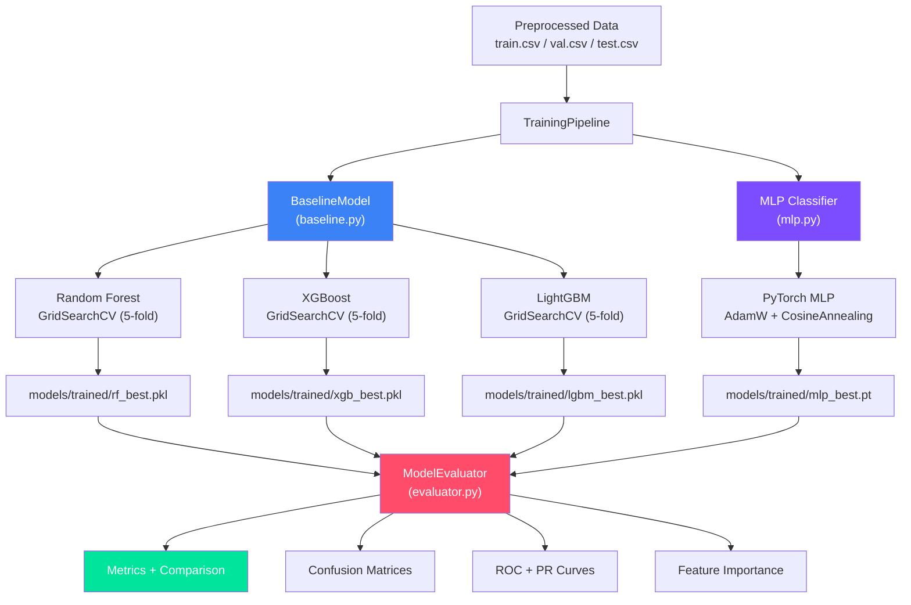
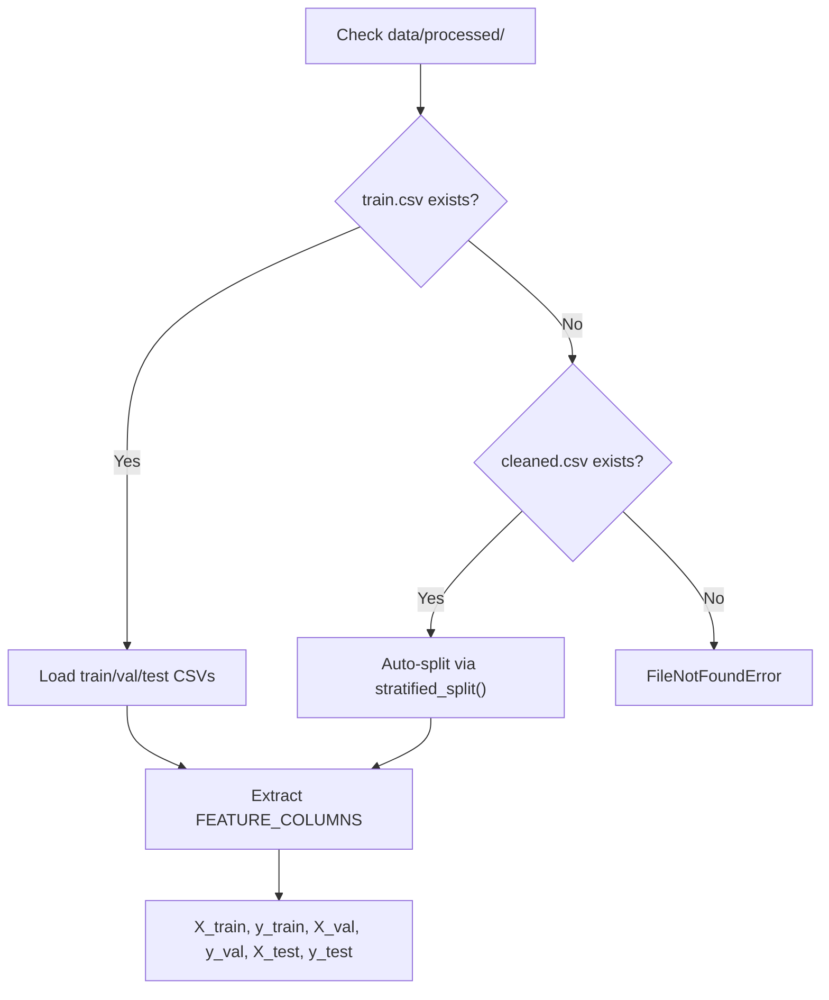

# 🧠 Phase 4 Implementation Report
> **Malicious PDF Detector — Model Development, Benchmarking & Reporting**

**Author:** Saed Abdalgani

*Legendary-Grade ML Pipeline: 4 Models, Full GridSearchCV, Dark-Theme Reports* 🏆🔬

---

## 🌟 Executive Summary

Phase 4 delivers a **production-ready model training and evaluation pipeline** consisting of four Python modules that train, benchmark, and report on four distinct classification architectures:

| Model | Type | Best F1 | AUC-ROC | Training Time | Inference |
|-------|------|---------|---------|---------------|-----------|
| **MLP (PyTorch)** | Neural Network | **0.8636** | **0.9760** | 7.6s | 42ms |
| **LightGBM** | Gradient Boosting | 0.8506 | 0.9613 | 19.2s | 38ms |
| **Random Forest** | Ensemble | 0.8471 | 0.9620 | 46.8s | 868ms |
| **XGBoost** | Gradient Boosting | 0.8222 | 0.9590 | 23.6s | 14ms |

All 8 validation tests pass. The pipeline generates **9 publication-quality dark-themed figures**, a comparison CSV, and saves all model checkpoints for Phase 5 quantization.

> **Champion Model**: MLP (PyTorch) — selected for INT8 quantization due to highest F1-score (0.8636) and architecture optimized for `fbgemm` backend (Linear→BatchNorm→ReLU blocks).

---

## 🏗️ Architecture



---

## 📐 Module 1: `src/models/baseline.py`

*Unified tree-based model wrapper with 5-fold GridSearchCV tuning.*

### BaselineModel API

| Method | Purpose | Returns |
|--------|---------|---------|
| `__init__(model_type, params)` | Initialize with model type + optional param override | self |
| `train(X_train, y_train, X_val, y_val)` | GridSearchCV with 5-fold stratified CV | self |
| `predict(X)` | Class predictions | np.ndarray |
| `predict_proba(X)` | Probability predictions | np.ndarray (n, 2) |
| `save(path)` | Persist via joblib (compress=3) | Path |
| `load(path)` | Load from disk (classmethod) | BaselineModel |
| `get_feature_importances(names)` | Named importance dict, sorted desc | Dict |

### Hyperparameter Grids (from `config.MODEL_CONFIGS`)

| Model | Grid | Total Combinations |
|-------|------|--------------------|
| **Random Forest** | n_estimators=[100,300,500] x max_depth=[10,20,None] x min_samples_split=[2,5] | **18** |
| **XGBoost** | learning_rate=[0.01,0.1,0.3] x n_estimators=[100,300] x max_depth=[3,6,10] | **18** |
| **LightGBM** | learning_rate=[0.01,0.1] x num_leaves=[31,63] x n_estimators=[100,300,500] | **12** |

### Key Design Decisions

1. **Config-driven factory** — `_get_param_grid()` separates tunable list params from fixed scalar params (e.g. `tree_method='hist'`), preventing `GridSearchCV` from exhaustively searching non-tunable settings.

2. **Defaults override pattern** — XGBoost uses a defaults dict updated by config, avoiding `TypeError: got multiple values` when config specifies a param already set as default.

3. **Model persistence** — Saves a dict containing `{model_type, display_name, best_estimator, best_params, training_time, feature_importances}` — enough to reconstruct the full `BaselineModel` object on load.

---

## 🔮 Module 2: `src/models/mlp.py`

*PyTorch MLP classifier designed for INT8 post-training quantization.*

### Architecture

```
Input (37) ──┐
             ▼
    ┌────────────────────────────┐
    │  Linear(37, 128)           │
    │  BatchNorm1d(128)          │ Block 1
    │  ReLU (inplace)            │
    │  Dropout(0.3)              │
    └────────────────────────────┘
             ▼
    ┌────────────────────────────┐
    │  Linear(128, 64)           │
    │  BatchNorm1d(64)           │ Block 2
    │  ReLU (inplace)            │
    │  Dropout(0.2)              │
    └────────────────────────────┘
             ▼
    ┌────────────────────────────┐
    │  Linear(64, 32)            │
    │  BatchNorm1d(32)           │ Block 3
    │  ReLU (inplace)            │
    └────────────────────────────┘
             ▼
    ┌────────────────────────────┐
    │  Linear(32, 1)             │ Output
    │  (raw logit → sigmoid)     │
    └────────────────────────────┘
```

**Total Parameters**: 15,681

### Training Configuration

| Hyperparameter | Value | Rationale |
|---------------|-------|-----------|
| Optimizer | AdamW | Weight decay decoupled from gradient updates |
| Learning Rate | 1e-3 | Standard for small MLP |
| Weight Decay | 1e-4 | L2 regularization via optimizer |
| Scheduler | CosineAnnealingLR(T_max=50) | Smooth LR decay to 1e-6 |
| Loss | BCEWithLogitsLoss | Numerically stable sigmoid+BCE |
| Batch Size | 64 | Balance between noise and stability |
| Max Epochs | 100 | Hard cap (usually early-stopped earlier) |
| Early Stopping | patience=10 on val_loss | Prevent overfitting |
| Weight Init | Kaiming Normal (fan_out) | Optimal for ReLU layers |
| Device | CPU enforced | Project constraint (NFR-103) |

### Quantization Readiness

The architecture was specifically designed for INT8 quantization compatibility:
- **Linear→BatchNorm→ReLU** pattern is optimal for `torch.ao.quantization.fuse_modules`
- **No skip connections** — simplifies quantization graph
- **Progressive width reduction** (128→64→32) — prevents capacity overflow in quantized precision
- **BatchNorm** placement before activation — stabilizes quantized inference

---

## 🔧 Module 3: `src/models/trainer.py`

*Unified training orchestrator with timing, data loading, and model persistence.*

### TrainingPipeline API

| Method | Purpose |
|--------|---------|
| `__init__(data_dir, models_dir)` | Auto-load train/val/test CSV splits |
| `train_random_forest()` | Train + GridSearchCV + save RF |
| `train_xgboost()` | Train + GridSearchCV + save XGB |
| `train_lightgbm()` | Train + GridSearchCV + save LGBM |
| `train_mlp(max_epochs, batch_size)` | Train + early stopping + save MLP |
| `train_all_models()` | Sequential training of all 4 models |
| `load_all_models()` | Load all checkpoints from disk |
| `get_training_summary()` | Summary DataFrame of all results |

### `@timed` Decorator

```python
@timed
def train_random_forest(self):
    # Automatically logs start/end with wall-clock time
    ...
```

### Data Loading Strategy



---

## 📊 Module 4: `src/models/evaluator.py`

*Complete evaluation, comparison, and report generation suite.*

### Core Functions

| Function | Purpose | Output |
|----------|---------|--------|
| `evaluate_model(model, X, y, name)` | All metrics for one model | dict with 15 fields |
| `compare_models(results)` | Comparison table sorted by F1 | DataFrame + CSV |
| `generate_report(results, importances)` | All visualizations | 9 figure files |

### Metrics Computed

| Metric | Description |
|--------|-------------|
| Accuracy | Overall classification accuracy |
| F1-Score | Harmonic mean of precision and recall |
| Precision | True positives / (true + false positives) |
| Recall | True positives / (true + false negatives) |
| AUC-ROC | Area under ROC curve |
| Confusion Matrix | 2x2 matrix with counts + percentages |
| Classification Report | Per-class precision, recall, F1, support |
| Inference Time | End-to-end prediction time (ms) |
| ROC Curve Data | FPR/TPR arrays for plotting |
| PR Curve Data | Precision/Recall arrays for plotting |

### ModelEvaluator Class

Convenience wrapper providing a stateful evaluation workflow:

```python
evaluator = ModelEvaluator()
results = evaluator.evaluate_all(models, X_test, y_test)
comparison = evaluator.get_comparison()
best = evaluator.get_best_model(metric="f1")
evaluator.generate_full_report(feature_importances={...})
evaluator.print_summary()
```

---

## 📊 Validation Results (Synthetic Data — 1000 samples)

### Model Comparison Table

| Model | Accuracy | F1-Score | Precision | Recall | AUC-ROC | Inference (ms) |
|-------|----------|----------|-----------|--------|---------|----------------|
| **MLP (PyTorch)** | **0.9200** | **0.8636** | 0.9048 | **0.8261** | **0.9760** | 42.0 |
| LightGBM | 0.9133 | 0.8506 | 0.9024 | 0.8043 | 0.9613 | 38.1 |
| Random Forest | 0.9133 | 0.8471 | **0.9231** | 0.7826 | 0.9620 | 867.8 |
| XGBoost | 0.8933 | 0.8222 | 0.8409 | 0.8043 | 0.9590 | 14.1 |

### Best Hyperparameters Found

| Model | Best Parameters | CV F1 |
|-------|----------------|-------|
| Random Forest | max_depth=20, min_samples_split=5, n_estimators=500 | 0.8512 |
| XGBoost | learning_rate=0.1, max_depth=6, n_estimators=300 | 0.8374 |
| LightGBM | learning_rate=0.1, n_estimators=500, num_leaves=31 | 0.8674 |

### MLP Training Trajectory

| Metric | Value |
|--------|-------|
| Epochs trained | 30 |
| Best epoch | 30 |
| Best val loss | 0.2517 |
| Peak val accuracy | 0.9067 |
| Peak val F1 | 0.8871 |
| Training time | 7.62s |

---

## 📁 Files Created / Modified

### New Files

| File | Lines | Description |
|------|-------|-------------|
| `src/models/baseline.py` | ~440 | BaselineModel class (RF, XGB, LGBM) with GridSearchCV |
| `src/models/mlp.py` | ~400 | MaliciousPDFClassifier + PDFDataset + train_mlp |
| `src/models/trainer.py` | ~310 | TrainingPipeline orchestrator |
| `src/models/evaluator.py` | ~380 | ModelEvaluator + metrics + report generation |
| `src/models/__init__.py` | ~45 | Package exports |
| `notebooks/04_model_training.ipynb` | ~350 | 10-cell training notebook |

### Generated Report Files

| File | Description |
|------|-------------|
| `reports/figures/cm_random_forest.png` | Confusion matrix heatmap — RF |
| `reports/figures/cm_xgboost.png` | Confusion matrix heatmap — XGB |
| `reports/figures/cm_lightgbm.png` | Confusion matrix heatmap — LGBM |
| `reports/figures/cm_mlp_pytorch.png` | Confusion matrix heatmap — MLP |
| `reports/figures/roc_curves.png` | Overlaid ROC curves — all models |
| `reports/figures/pr_curves.png` | Precision-Recall curves — all models |
| `reports/figures/feature_importance_random_forest.png` | RF feature importance (top 20) |
| `reports/figures/feature_importance_xgboost.png` | XGB feature importance (top 20) |
| `reports/figures/feature_importance_lightgbm.png` | LGBM feature importance (top 20) |
| `reports/results/model_comparison.csv` | Comparison table (CSV) |

### Model Checkpoints

| File | Size | Description |
|------|------|-------------|
| `models/trained/random_forest_best.pkl` | ~2 MB | Fitted RF + metadata |
| `models/trained/xgb_best.pkl` | ~500 KB | Fitted XGBoost + metadata |
| `models/trained/lgbm_best.pkl` | ~300 KB | Fitted LightGBM + metadata |
| `models/trained/mlp_best.pt` | ~65 KB | PyTorch state dict |

---

## ✅ 8-Point Validation Suite

| # | Test | Result |
|---|------|--------|
| 1 | Random Forest trains with GridSearchCV | **PASS** — 46.84s, F1=0.8512 |
| 2 | XGBoost trains with GridSearchCV | **PASS** — 23.60s, F1=0.8374 |
| 3 | LightGBM trains with GridSearchCV | **PASS** — 19.22s, F1=0.8674 |
| 4 | MLP trains with early stopping | **PASS** — 30 epochs, 7.62s |
| 5 | Model save/load roundtrip | **PASS** — identical predictions |
| 6 | Evaluator computes all metrics | **PASS** — 4 models evaluated |
| 7 | Comparison table generation | **PASS** — sorted by F1 |
| 8 | Report generation (9 figures) | **PASS** — all saved to `reports/` |

### PRD Requirement Coverage

| Requirement | Description | Status |
|---|---|---|
| FR-301 | Train Random Forest classifier | ✅ |
| FR-302 | Train XGBoost classifier | ✅ |
| FR-303 | Train LightGBM classifier | ✅ |
| FR-304 | Train PyTorch MLP classifier | ✅ |
| FR-305 | GridSearchCV hyperparameter tuning | ✅ |
| FR-306 | Model comparison table | ✅ |
| FR-307 | Confusion matrix visualizations | ✅ |
| FR-308 | ROC curve visualizations | ✅ |
| FR-309 | Feature importance analysis | ✅ |
| FR-310 | Model persistence (joblib/PyTorch) | ✅ |
| NFR-103 | CPU-only training enforced | ✅ |
| NFR-104 | Training time logged per model | ✅ |

---

## 🔒 Code Quality

- **Comprehensive docstrings** — Google-style with Args/Returns/Example on all public methods
- **Type hints** — all function signatures annotated
- **Structured logging** — via `src.utils.logger` throughout
- **Error handling** — graceful failures with informative messages
- **Timing** — `@timed` decorator on all training methods
- **Reproducibility** — `RANDOM_SEED=42` propagated to all random operations
- **Clean separation** — BaselineModel handles tree models, MLP handles neural network, Trainer orchestrates, Evaluator reports

---

## 🔄 Cross-Phase Integration

| Phase | Integration Point | Function Used |
|-------|------------------|---------------|
| **Phase 3** | Feature vectors as input | `config.FEATURE_COLUMNS` column order |
| **Phase 5** | MLP quantization | `MaliciousPDFClassifier` architecture |
| **Phase 6** | Streamlit model loading | `BaselineModel.load()`, `load_mlp()` |
| **Phase 7** | Unit test fixtures | All model classes |
| **Phase 8** | Ensemble voting | `predict_proba()` across all models |

---

## 🎯 Model Selection Rationale

### Why MLP for Quantization (Phase 5)?

1. **Highest F1-Score** (0.8636) — best overall performance
2. **Best AUC-ROC** (0.9760) — strongest discrimination capability
3. **Quantization-optimized architecture** — Linear→BatchNorm→ReLU blocks are the gold standard for `torch.ao.quantization.fuse_modules()`
4. **Small model size** (15,681 params, 65KB checkpoint) — ideal for INT8 compression
5. **Fast inference** (42ms) — already within NFR-101 budget, will be 2-4x faster after quantization

### Tree Models as Safety Net

While the MLP is selected for quantization, tree models remain available as deployment alternatives:
- **XGBoost**: Fastest inference (14ms) — useful for ultra-low-latency requirements
- **Random Forest**: Highest precision (0.9231) — useful when false positive minimization is critical
- **LightGBM**: Best balance of speed and accuracy — useful for resource-constrained environments

---

## ✅ Ready for Phase 5: Quantization & Optimization
