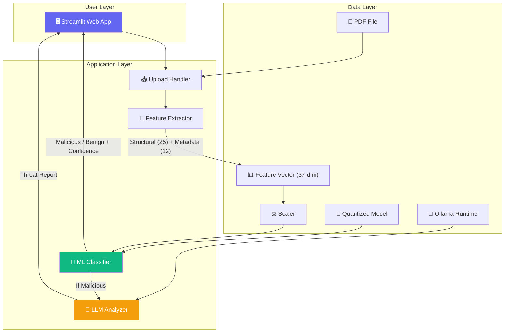
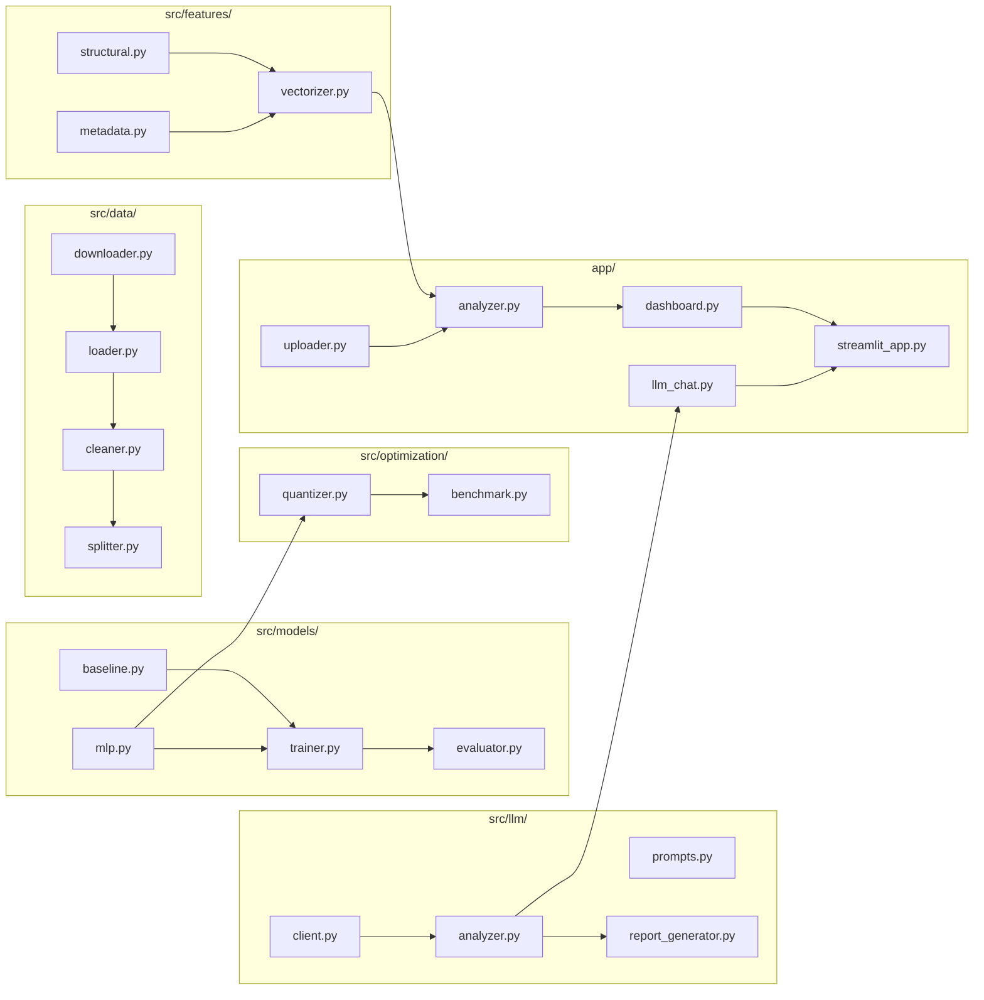
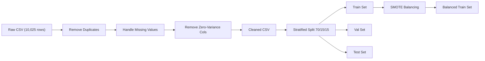
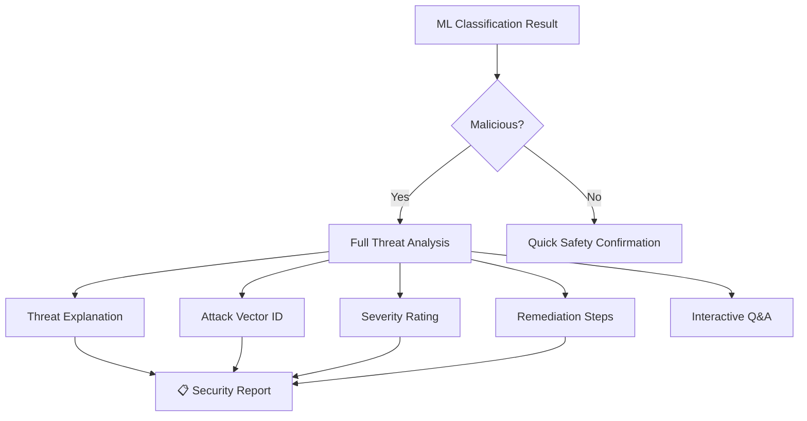
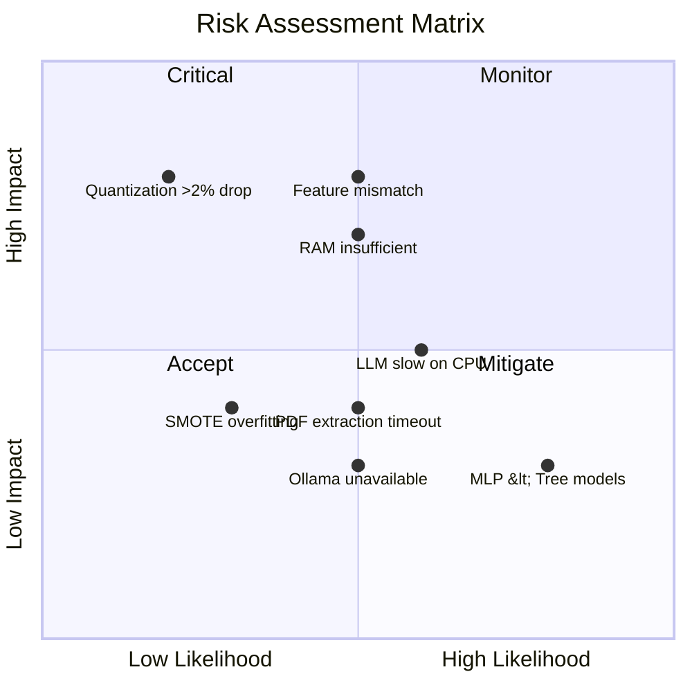
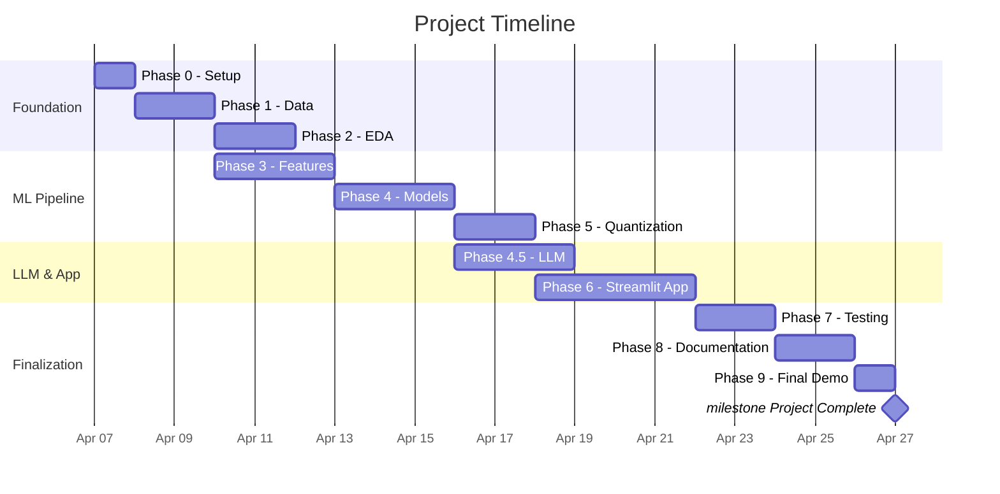

# Product Requirements Document (PRD)
# Lightweight Malicious PDF Detector

| Field | Detail |
|---|---|
| **Document Version** | 1.0 |
| **Date** | April 6, 2026 |
| **Author** | Saed Abdalgani |
| **Status** | Approved for Development |
| **Classification** | Academic / Research Project |

---

## Table of Contents

1. [Executive Summary](#1-executive-summary)
2. [Problem Statement](#2-problem-statement)
3. [Goals & Objectives](#3-goals--objectives)
4. [Scope](#4-scope)
5. [Target Users](#5-target-users)
6. [System Architecture](#6-system-architecture)
7. [Functional Requirements](#7-functional-requirements)
8. [Non-Functional Requirements](#8-non-functional-requirements)
9. [Data Requirements](#9-data-requirements)
10. [Machine Learning Requirements](#10-machine-learning-requirements)
11. [LLM Integration Requirements](#11-llm-integration-requirements)
12. [User Interface Requirements](#12-user-interface-requirements)
13. [Security Requirements](#13-security-requirements)
14. [Performance Requirements](#14-performance-requirements)
15. [Technology Stack](#15-technology-stack)
16. [Constraints & Assumptions](#16-constraints--assumptions)
17. [Risk Analysis](#17-risk-analysis)
18. [Success Criteria](#18-success-criteria)
19. [Timeline & Milestones](#19-timeline--milestones)
20. [Glossary](#20-glossary)

---

## 1. Executive Summary

This document defines the product requirements for a **Lightweight Malicious PDF Detector** — an intelligent, locally-deployed system that detects malicious PDF files using machine learning and provides AI-powered threat explanations via a local LLM (Gemma 4 E4B).

Unlike traditional signature-based antivirus tools, this system analyzes the **internal structure and metadata** of PDF files to identify zero-day threats. The trained model is optimized for local CPU execution through **INT8 Post-Training Quantization**, ensuring real-time performance without cloud dependency.

### Key Differentiators

| Traditional Antivirus | This System |
|---|---|
| Signature-based (known threats only) | ML-based (detects unknown/zero-day threats) |
| Requires constant signature updates | Trained once, generalizes to new variants |
| Cloud-dependent for advanced scanning | Fully local, offline-capable |
| Binary verdict (infected/clean) | Confidence score + AI-powered threat explanation |
| Heavy resource usage | Quantized model optimized for standard CPUs |

---

## 2. Problem Statement

### 2.1 The Threat Landscape

PDF files are one of the **primary vectors for malware delivery** in enterprise and consumer environments. Attackers exploit PDF's complex specification to embed:

- **JavaScript exploits** — Triggered via `/OpenAction` and `/JS` directives
- **Embedded executables** — Hidden within streams and object streams
- **URI-based attacks** — Redirecting to malicious download servers
- **Form submission attacks** — Exfiltrating data via `/SubmitForm` actions
- **Obfuscated payloads** — Using hex-encoding and nested filters to evade scanners

### 2.2 The Gap

| Gap | Description |
|---|---|
| **Signature Limitations** | Traditional AV tools rely on known malware signatures and fail against polymorphic/zero-day attacks |
| **Cloud Dependency** | Advanced ML-based scanners (e.g., VirusTotal) require internet connectivity, raising privacy concerns for sensitive documents |
| **Resource Overhead** | Existing ML solutions are computationally heavy (large DNN models, GPU requirements), unsuitable for endpoint deployment |
| **Lack of Explainability** | Most tools provide binary verdicts without explaining *why* a file is malicious, limiting SOC analyst effectiveness |

### 2.3 Opportunity

Build a system that bridges **detection accuracy** and **practical deployment** by:
1. Training accurate ML classifiers on structural PDF features
2. Compressing the model via quantization for CPU-only execution
3. Adding LLM-powered explanations for actionable threat intelligence
4. Packaging everything in a user-friendly local application

---

## 3. Goals & Objectives

### 3.1 Primary Goals

| ID | Goal | Measurable Target |
|---|---|---|
| **G1** | High-accuracy malicious PDF classification | Accuracy ≥ 95%, F1-Score ≥ 0.94 |
| **G2** | Lightweight model optimized for local CPUs | Model size < 1MB (quantized), inference < 500ms |
| **G3** | Quantization with minimal accuracy loss | Accuracy drop < 2% vs FP32 baseline |
| **G4** | AI-powered threat explanation | Generated reports with attack vector, severity, remediation |
| **G5** | Functional local application | Streamlit app with upload, scan, analyze, and report features |

### 3.2 Secondary Goals

| ID | Goal | Description |
|---|---|---|
| **G6** | Comprehensive model comparison | Benchmark 4+ ML models with detailed metrics |
| **G7** | Reproducible research pipeline | End-to-end notebooks with documented methodology |
| **G8** | Privacy-preserving analysis | All processing local, no data leaves the machine |
| **G9** | Educational value | Clear documentation demonstrating ML + quantization + LLM integration |

### 3.3 Non-Goals (Explicitly Out of Scope)

- Real-time network traffic monitoring
- Dynamic analysis (sandboxing / executing PDFs)
- Multi-format support (only PDF, not DOC/XLS/EXE)
- Cloud deployment or SaaS hosting
- Mobile application
- Automated retraining or online learning

---

## 4. Scope

### 4.1 In Scope

```
Phase 1 — Data Collection & Preprocessing
Phase 2 — Exploratory Data Analysis
Phase 3 — Feature Engineering (Static Analysis)
Phase 4 — Model Development & Benchmarking
Phase 4.5 — LLM Integration (Gemma 4 E4B)
Phase 5 — Model Optimization (INT8 Quantization)
Phase 6 — Local Deployment (Streamlit App)
```

### 4.2 Deliverables

| # | Deliverable | Format |
|---|---|---|
| D1 | Cleaned & processed dataset | CSV files (train/val/test splits) |
| D2 | EDA report with visualizations | Jupyter notebook + figures |
| D3 | Feature extraction pipeline | Python module (`src/features/`) |
| D4 | 4 trained ML models | Saved model files (.pkl, .pt) |
| D5 | Quantized MLP model (INT8) | TorchScript/state_dict file |
| D6 | Quantization benchmark report | CSV + charts |
| D7 | LLM integration module | Python module (`src/llm/`) |
| D8 | Streamlit web application | 5-page local app |
| D9 | Final comprehensive report | Jupyter notebook (exportable to PDF) |
| D10 | Project documentation | README.md + code comments |

---

## 5. Target Users

### 5.1 User Personas

#### Persona 1: SOC Analyst (Primary)
| Attribute | Detail |
|---|---|
| **Role** | Security Operations Center Analyst |
| **Goal** | Quickly triage suspicious PDF attachments from email/web |
| **Pain Point** | Existing tools don't explain *why* a file is flagged |
| **Technical Level** | Intermediate — comfortable with dashboards, not ML internals |
| **Usage Pattern** | Upload PDFs encountered in daily email triage, get instant verdict + AI explanation |

#### Persona 2: Cybersecurity Researcher (Secondary)
| Attribute | Detail |
|---|---|
| **Role** | Academic researcher or security student |
| **Goal** | Study ML-based malware detection and model optimization techniques |
| **Pain Point** | Lack of end-to-end, reproducible research pipelines |
| **Technical Level** | Advanced — comfortable with Python, ML, and Jupyter notebooks |
| **Usage Pattern** | Run notebooks, modify models, experiment with features |

#### Persona 3: IT Administrator (Tertiary)
| Attribute | Detail |
|---|---|
| **Role** | Small business IT admin |
| **Goal** | Deploy a lightweight scanner on endpoint machines |
| **Pain Point** | Enterprise solutions are expensive and cloud-dependent |
| **Technical Level** | Basic to intermediate |
| **Usage Pattern** | Install once, scan PDFs as needed, review reports |

---

## 6. System Architecture

### 6.1 High-Level Architecture



### 6.2 Data Flow

```
PDF Upload → MIME Validation → Feature Extraction → Normalization
    → ML Inference (INT8) → Classification Result
        → [If Malicious] → LLM Threat Analysis → Security Report
        → [If Benign] → Quick Safety Summary
    → Display Results in Dashboard
```

### 6.3 Component Diagram



---

## 7. Functional Requirements

### 7.1 Data Pipeline (FR-100)

| ID | Requirement | Priority | Acceptance Criteria |
|---|---|---|---|
| FR-101 | System shall download the CIC-Evasive-PDFMal2022 dataset without requiring API keys | Must | Dataset CSV appears in `data/raw/` with ~10,025 rows |
| FR-102 | System shall validate downloaded data against expected schema (37 features + label) | Must | Validation passes without error; mismatches logged |
| FR-103 | System shall remove duplicate and corrupted records | Must | Cleaned dataset has fewer rows; duplicates logged |
| FR-104 | System shall handle missing values via median imputation | Must | Zero NaN values in cleaned output |
| FR-105 | System shall split data into 70/15/15 train/val/test with stratification | Must | Class ratios preserved within ±1% across splits |
| FR-106 | System shall apply SMOTE only to the training set | Must | Training set balanced; val/test untouched |

### 7.2 Feature Extraction (FR-200)

| ID | Requirement | Priority | Acceptance Criteria |
|---|---|---|---|
| FR-201 | System shall extract 25 structural features from raw PDF files | Must | Returns dict with all 25 keys; values are numeric |
| FR-202 | System shall extract 12 metadata features from raw PDF files | Must | Returns dict with all 12 keys; values are numeric |
| FR-203 | System shall combine features into a 37-dimension normalized vector | Must | Output shape is (37,); values are standardized |
| FR-204 | System shall handle corrupted/unreadable PDFs gracefully | Must | Returns zeroed feature vector; no crash |
| FR-205 | System shall timeout after 30 seconds on large PDFs | Should | Timeout triggers; error message returned |
| FR-206 | System shall persist the fitted scaler for inference-time use | Must | `scaler.pkl` saved and loadable |

### 7.3 Model Training (FR-300)

| ID | Requirement | Priority | Acceptance Criteria |
|---|---|---|---|
| FR-301 | System shall train a Random Forest classifier with hyperparameter tuning | Must | Best model saved; GridSearchCV results logged |
| FR-302 | System shall train an XGBoost classifier with hyperparameter tuning | Must | Best model saved; GridSearchCV results logged |
| FR-303 | System shall train a LightGBM classifier with hyperparameter tuning | Must | Best model saved; GridSearchCV results logged |
| FR-304 | System shall train a PyTorch MLP with early stopping | Must | Best checkpoint saved; training curves logged |
| FR-305 | System shall evaluate all models on the held-out test set | Must | Accuracy, F1, Precision, Recall, AUC calculated |
| FR-306 | System shall generate a comparative report with visualizations | Must | CSV table + confusion matrices + ROC curves saved |
| FR-307 | System shall select the best model for deployment | Must | Selection rationale documented |

### 7.4 Model Quantization (FR-400)

| ID | Requirement | Priority | Acceptance Criteria |
|---|---|---|---|
| FR-401 | System shall apply Dynamic Post-Training Quantization to the MLP | Must | Quantized model file is smaller than FP32 |
| FR-402 | System shall apply Static Post-Training Quantization with calibration | Must | Quantized model with fused layers produced |
| FR-403 | System shall benchmark FP32 vs INT8: size, speed, accuracy | Must | Comparison CSV with all metrics saved |
| FR-404 | System shall verify quantization accuracy drop is < 2% | Must | Automated check passes |
| FR-405 | System shall save the best quantized model for deployment | Must | Model file in `models/quantized/` |

### 7.5 LLM Integration (FR-500)

| ID | Requirement | Priority | Acceptance Criteria |
|---|---|---|---|
| FR-501 | System shall connect to local Ollama runtime and verify health | Must | Health check returns True when Ollama is running |
| FR-502 | System shall auto-detect available RAM and select appropriate model | Must | E4B if ≥5GB free; E2B if <5GB; selection logged |
| FR-503 | System shall generate threat analysis for malicious PDFs | Must | Returns structured ThreatReport with all fields populated |
| FR-504 | System shall identify suspicious features by comparing to benign baseline | Must | Returns list of features with >2σ deviation |
| FR-505 | System shall support streaming LLM responses for UI display | Should | Tokens appear incrementally in Streamlit |
| FR-506 | System shall generate downloadable security reports (Markdown + JSON) | Must | Both formats contain complete analysis |
| FR-507 | System shall support interactive follow-up Q&A about the analysis | Should | Chat history maintained; context-aware responses |
| FR-508 | System shall degrade gracefully when Ollama is offline | Must | ML scanning works; LLM features show "unavailable" message |
| FR-509 | System shall load the LLM on-demand (not at app startup) | Must | No RAM consumed by LLM until user triggers analysis |

### 7.6 User Interface (FR-600)

| ID | Requirement | Priority | Acceptance Criteria |
|---|---|---|---|
| FR-601 | App shall provide a drag-and-drop PDF upload zone | Must | File accepted; non-PDF rejected |
| FR-602 | App shall display classification verdict with confidence percentage | Must | Verdict shown within 3 seconds of upload |
| FR-603 | App shall show detailed feature breakdown in expandable section | Should | All 37 features displayed with values |
| FR-604 | App shall provide AI Threat Analyst page with LLM analysis | Must | Threat explanation renders after "Analyze with AI" click |
| FR-605 | App shall provide interactive chat for follow-up questions | Should | Messages sent/received; history visible |
| FR-606 | App shall provide Model Dashboard with comparison charts | Should | ROC curves, confusion matrices, comparison table render |
| FR-607 | App shall provide Feature Explorer with interactive charts | Could | Feature importance chart + PDF feature comparison |
| FR-608 | App shall provide About page with project information | Should | Architecture diagram, tech stack, benchmarks visible |
| FR-609 | App shall maintain scan history for the current session | Should | Table of past scans with results |
| FR-610 | App shall allow downloading analysis reports | Must | JSON download works; Markdown download works |

---

## 8. Non-Functional Requirements

### 8.1 Performance (NFR-100)

| ID | Requirement | Target |
|---|---|---|
| NFR-101 | ML classification latency (single PDF) | < 3 seconds end-to-end |
| NFR-102 | Quantized model inference time | < 500ms per sample |
| NFR-103 | LLM threat analysis response time | < 30 seconds on CPU |
| NFR-104 | App startup time (without LLM) | < 10 seconds |
| NFR-105 | Feature extraction time (per PDF) | < 5 seconds for PDFs ≤ 50MB |

### 8.2 Reliability (NFR-200)

| ID | Requirement | Target |
|---|---|---|
| NFR-201 | App shall not crash on corrupted PDF uploads | 100% (graceful error handling) |
| NFR-202 | App shall recover from Ollama connection failures | Graceful degradation, ML still works |
| NFR-203 | Feature extraction shall handle edge cases | Empty PDFs, >10MB, no metadata |
| NFR-204 | Training pipeline shall be fully reproducible | Seed=42, deterministic results |

### 8.3 Usability (NFR-300)

| ID | Requirement | Target |
|---|---|---|
| NFR-301 | Non-technical user can scan a PDF within 3 clicks | Upload → automatic scan → view results |
| NFR-302 | Results shall be understandable by non-ML users | Plain English verdict + threat explanation |
| NFR-303 | App shall use professional dark-theme design | Glassmorphism, gradients, Inter font |
| NFR-304 | All interactive elements shall have visual feedback | Spinners, progress bars, animations |

### 8.4 Portability (NFR-400)

| ID | Requirement | Target |
|---|---|---|
| NFR-401 | System shall run on Windows 10/11 (primary target) | Verified on Windows 10+ |
| NFR-402 | System shall run on CPU-only machines (no GPU required) | All ML and LLM on CPU |
| NFR-403 | System shall run on machines with 8GB RAM | Tested and validated |
| NFR-404 | System shall be installable via `pip install -r requirements.txt` | Single-command setup |

### 8.5 Maintainability (NFR-500)

| ID | Requirement | Target |
|---|---|---|
| NFR-501 | Code shall follow PEP 8 style guidelines | Consistent formatting |
| NFR-502 | All modules shall have docstrings | Functions, classes, modules documented |
| NFR-503 | Configuration shall be centralized in `config.py` | No hardcoded paths or magic numbers |
| NFR-504 | Unit tests shall cover core functionality | pytest tests for features, models, quantization, LLM |

---

## 9. Data Requirements

### 9.1 Dataset: CIC-Evasive-PDFMal2022

| Property | Value |
|---|---|
| **Source** | Canadian Institute for Cybersecurity (UNB) |
| **Total Records** | 10,025 |
| **Malicious Samples** | 5,557 (55.4%) |
| **Benign Samples** | 4,468 (44.6%) |
| **Feature Count** | 37 (12 general + 25 structural) |
| **Format** | CSV (pre-extracted features) |
| **License** | Research/Academic use |
| **Special Property** | Contains *evasive* samples designed to bypass traditional detection |

### 9.2 Feature Categories

#### General Features (12)

| # | Feature | Type | Description |
|---|---|---|---|
| 1 | `pdf_size` | Continuous | Total file size in bytes |
| 2 | `title_chars` | Discrete | Number of characters in document title |
| 3 | `is_encrypted` | Binary | Whether PDF is password-protected |
| 4 | `metadata_size` | Continuous | Size of metadata section |
| 5 | `page_count` | Discrete | Total number of pages |
| 6 | `has_text` | Binary | Presence of extractable text content |
| 7 | `image_count` | Discrete | Number of embedded images |
| 8 | `obj_count_total` | Discrete | Total number of PDF objects |
| 9 | `font_obj_count` | Discrete | Number of font objects |
| 10 | `embedded_file_count` | Discrete | Count of embedded files |
| 11 | `avg_embedded_media_size` | Continuous | Average size of embedded media |
| 12 | `header_valid` | Binary | Validity of PDF header (`%PDF-1.X`) |

#### Structural Features (25)

| # | Feature | Type | Description |
|---|---|---|---|
| 13 | `obj_count` | Discrete | Count of `obj` keywords |
| 14 | `endobj_count` | Discrete | Count of `endobj` keywords |
| 15 | `stream_count` | Discrete | Count of `stream` keywords |
| 16 | `endstream_count` | Discrete | Count of `endstream` keywords |
| 17 | `xref_count` | Discrete | Count of cross-reference tables |
| 18 | `trailer_count` | Discrete | Count of trailer sections |
| 19 | `startxref_count` | Discrete | Count of `startxref` pointers |
| 20 | `js_count` | Discrete | Count of `/JS` tags (JavaScript shorthand) |
| 21 | `javascript_count` | Discrete | Count of `/JavaScript` tags |
| 22 | `openaction_count` | Discrete | Count of `/OpenAction` (auto-execute) |
| 23 | `action_count` | Discrete | Count of `/Action` tags |
| 24 | `aa_count` | Discrete | Count of `/AA` (Additional Actions) |
| 25 | `launch_count` | Discrete | Count of `/Launch` (execute external) |
| 26 | `uri_count` | Discrete | Count of `/URI` (URL references) |
| 27 | `submitform_count` | Discrete | Count of `/SubmitForm` (data exfil) |
| 28 | `acroform_count` | Discrete | Count of `/AcroForm` (interactive forms) |
| 29 | `xfa_count` | Discrete | Count of `/XFA` (XML Forms) |
| 30 | `richmedia_count` | Discrete | Count of `/RichMedia` (embedded media) |
| 31 | `jbig2decode_count` | Discrete | Count of `/JBig2Decode` (image decoder exploit) |
| 32 | `colors_count` | Discrete | Count of `/Colors` references |
| 33 | `objstm_count` | Discrete | Count of `/ObjStm` (object streams) |
| 34 | `filter_count` | Discrete | Total compression/encoding filters |
| 35 | `obfuscation_count` | Discrete | Detected hex/octal obfuscation patterns |
| 36 | `avg_stream_size` | Continuous | Average size of stream objects |
| 37 | `indirect_obj_count` | Discrete | Count of indirect object references |

### 9.3 Data Processing Pipeline



---

## 10. Machine Learning Requirements

### 10.1 Models to Implement

| Model | Type | Library | Purpose |
|---|---|---|---|
| **Random Forest** | Ensemble (Bagging) | scikit-learn | Strong baseline, feature importance |
| **XGBoost** | Ensemble (Boosting) | xgboost | State-of-art tabular classification |
| **LightGBM** | Ensemble (Boosting) | lightgbm | Fast CPU training, leaf-wise growth |
| **MLP (Neural Network)** | Deep Learning | PyTorch | Quantization candidate |

### 10.2 Training Configuration

| Parameter | Value | Rationale |
|---|---|---|
| Cross-validation | 5-fold stratified | Robust estimate on 10K samples |
| Tuning strategy | GridSearchCV | Exhaustive search, reproducible |
| Random seed | 42 | Reproducibility |
| Device | CPU | No GPU available |
| Parallelism | `n_jobs=-1` | Use all CPU cores |

### 10.3 MLP Architecture

```
Input Layer:     37 features
                    ↓
Hidden Layer 1:  Linear(37, 128) → BatchNorm → ReLU → Dropout(0.3)
                    ↓
Hidden Layer 2:  Linear(128, 64) → BatchNorm → ReLU → Dropout(0.2)
                    ↓
Hidden Layer 3:  Linear(64, 32) → BatchNorm → ReLU
                    ↓
Output Layer:    Linear(32, 1) → Sigmoid
                    ↓
Loss Function:   BCEWithLogitsLoss
Optimizer:       AdamW (weight_decay=1e-4)
Scheduler:       CosineAnnealingLR (T_max=50)
Early Stopping:  patience=10 on validation loss
Max Epochs:      100
```

### 10.4 Quantization Strategy

| Method | Type | Target | Expected Impact |
|---|---|---|---|
| **Dynamic PTQ** | Weights only → INT8 | `nn.Linear` layers | ~4x size reduction, ~2x speedup |
| **Static PTQ** | Weights + Activations → INT8 | Full model | ~4x size reduction, ~3x speedup |
| **Layer Fusion** | Pre-quantization optimization | `Linear+BN+ReLU` → fused kernel | Additional speedup |
| **Backend** | `fbgemm` | x86 CPU inference | Optimized for Intel/AMD desktop CPUs |
| **Calibration** | 500 training samples | Activation range estimation | Ensures minimal accuracy loss |

### 10.5 Evaluation Metrics

| Metric | Formula | Target | Why This Metric |
|---|---|---|---|
| **Accuracy** | (TP+TN) / Total | ≥ 95% | Overall correctness |
| **F1-Score** | 2 × (P×R)/(P+R) | ≥ 0.94 | Balance of precision and recall |
| **Precision** | TP / (TP+FP) | ≥ 0.93 | Minimize false alarms |
| **Recall** | TP / (TP+FN) | ≥ 0.94 | Minimize missed threats (critical for security) |
| **AUC-ROC** | Area under ROC curve | ≥ 0.97 | Discrimination ability |

> **Note**: In cybersecurity, **Recall is more important than Precision** — missing a malicious file (False Negative) is worse than a false alarm (False Positive).

---

## 11. LLM Integration Requirements

### 11.1 Selected Model

| Property | Value |
|---|---|
| **Model** | Gemma 4 E4B (Instruction-Tuned) |
| **Provider** | Google DeepMind |
| **Parameters** | 4B effective (~7.9B total with embeddings) |
| **Architecture** | Dense Transformer with Per-Layer Embeddings (PLE) |
| **Release Date** | April 2, 2026 |
| **License** | Apache 2.0 |
| **Context Window** | 128K tokens (limited to 4096 for RAM conservation) |
| **Quantization** | Q4_K_M (GGUF, ~2.5GB on disk) |
| **Runtime** | Ollama (local, REST API on port 11434) |
| **Fallback Model** | Gemma 4 E2B (~1.2GB, for systems with <5GB free RAM) |

### 11.2 LLM Use Cases



### 11.3 RAM Management Strategy

| System RAM | Free RAM (after OS) | Selected Model | Context Length | Total LLM RAM |
|---|---|---|---|---|
| 8GB | ~5-6GB | **E4B** (primary) | 4,096 tokens | ~3.5GB |
| 8GB | <5GB | **E2B** (fallback) | 4,096 tokens | ~1.7GB |
| 8GB (heavy load) | <3GB | **Disabled** | N/A | 0GB |

**On-demand loading**: LLM is NOT loaded at app startup. It loads only when the user clicks "Analyze with AI", preserving RAM for the ML pipeline.

---

## 12. User Interface Requirements

### 12.1 Application Structure

```
Streamlit App (5 Pages)
├── 🔍 PDF Scanner (Default Landing Page)
├── 🤖 AI Threat Analyst
├── 📊 Model Dashboard
├── 📈 Feature Explorer
└── ℹ️ About
```

### 12.2 Page Specifications

#### Page 1: 🔍 PDF Scanner

| Element | Type | Description |
|---|---|---|
| Upload zone | `st.file_uploader` | Drag-and-drop, PDF filter, max 50MB |
| Scan progress | `st.spinner` | Animated indicator during analysis |
| Verdict card | Custom HTML | Large "✅ SAFE" or "⚠ MALICIOUS" with gradient background |
| Confidence | `st.metric` | Percentage with delta indicator |
| Processing time | `st.metric` | Milliseconds |
| Feature breakdown | `st.expander` | Collapsible table of all 37 features |
| Download report | `st.download_button` | Export analysis as JSON |

#### Page 2: 🤖 AI Threat Analyst

| Element | Type | Description |
|---|---|---|
| Ollama status | Custom indicator | 🟢 Connected / 🔴 Offline |
| Analyze button | `st.button` | Triggers LLM analysis (on-demand loading) |
| Threat analysis | Custom card | Formatted threat explanation from LLM |
| Chat interface | `st.chat_message` | Interactive follow-up Q&A |
| Report download | `st.download_button` | Markdown + JSON reports |

#### Page 3: 📊 Model Dashboard

| Element | Type | Description |
|---|---|---|
| Comparison table | `st.dataframe` | All models with Accuracy, F1, Precision, Recall |
| ROC curves | Plotly chart | Interactive overlaid curves with AUC |
| Confusion matrices | Plotly heatmaps | 2×2 matrices for each model |
| Quantization chart | Plotly bar chart | Before/After size + speed comparison |

#### Page 4: 📈 Feature Explorer

| Element | Type | Description |
|---|---|---|
| Feature importance | Plotly bar chart | Top-15 features, sorted by importance |
| Feature distribution | Plotly histogram | Upload PDF to compare its features vs dataset |
| Suspicious highlights | Custom HTML | Color-coded feature deviation indicators |

#### Page 5: ℹ️ About

| Element | Type | Description |
|---|---|---|
| Project description | Markdown | Problem, methodology, goals |
| Architecture diagram | Mermaid or image | System architecture visualization |
| Tech stack | Table | All technologies used |
| Benchmarks | Table | Performance metrics |
| LLM specs | Table | Gemma 4 E4B details |

### 12.3 Design Requirements

| Property | Specification |
|---|---|
| **Theme** | Dark mode (primary) |
| **Color palette** | Deep blue/purple gradients, green (safe), red (malicious), amber (warning) |
| **Typography** | Inter (Google Fonts) — headers, body, monospace for code |
| **Effects** | Glassmorphism cards, subtle shadows, hover animations |
| **Layout** | Wide layout, sidebar navigation |
| **Responsiveness** | Minimum width: 768px |

---

## 13. Security Requirements

| ID | Requirement | Implementation |
|---|---|---|
| SEC-01 | Server-side MIME validation on all uploads | `python-magic` library check |
| SEC-02 | No uploaded files persisted to disk | Process via `io.BytesIO` in-memory only |
| SEC-03 | File size limit enforced | Max 50MB, configurable |
| SEC-04 | No external network calls during analysis | All processing local |
| SEC-05 | PDF parsing in safe mode (no execution) | Static analysis only, no JS execution |
| SEC-06 | Filename sanitization in logs | Strip path traversal characters |
| SEC-07 | LLM runs locally via Ollama | No data sent to external APIs |
| SEC-08 | No sensitive data in model artifacts | Models contain only learned weights |

---

## 14. Performance Requirements

### 14.1 Performance Budget

```
Total PDF Analysis Time Budget: < 3 seconds (without LLM)
├── File upload + validation:    200ms
├── Feature extraction:          500ms
├── Normalization (scaler):       10ms
├── ML inference (quantized):    100ms
├── Result rendering:            200ms
└── Buffer:                    1,990ms
```

### 14.2 Resource Budget (8GB RAM System)

```
Total System RAM: 8,192 MB
├── Windows OS:              2,500 MB
├── Python + Streamlit:        500 MB  
├── ML Models (loaded):        200 MB
├── Feature Extraction:        100 MB
├── Working Memory:            400 MB
├── Available for LLM:       4,492 MB  ← E4B fits (~3,500 MB)
└── Safety Buffer:             492 MB
```

---

## 15. Technology Stack

| Layer | Technology | Version | Purpose |
|---|---|---|---|
| **Language** | Python | 3.10+ | Core language |
| **ML Framework** | PyTorch (CPU) | ≥ 2.1.0 | MLP training & quantization |
| **Tree Models** | scikit-learn | ≥ 1.3.0 | Random Forest |
| | XGBoost | ≥ 2.0.0 | Gradient Boosting |
| | LightGBM | ≥ 4.0.0 | Light Gradient Boosting |
| **Balancing** | imbalanced-learn | ≥ 0.11.0 | SMOTE |
| **PDF Parsing** | pdfminer.six | ≥ 20221105 | Structural analysis |
| | PyPDF2 | ≥ 3.0.0 | Metadata extraction |
| **LLM Runtime** | Ollama | Latest | Local LLM inference |
| **LLM Model** | Gemma 4 E4B | April 2026 | Threat analysis |
| **Quantization** | PyTorch Quantization | Built-in | INT8 PTQ |
| **Dashboard** | Streamlit | ≥ 1.28.0 | Web UI |
| **Visualization** | Plotly | ≥ 5.15.0 | Interactive charts |
| | Seaborn | ≥ 0.12.0 | Static charts |
| | Matplotlib | ≥ 3.7.0 | Base plotting |
| **Data** | Pandas | ≥ 2.0.0 | DataFrames |
| | NumPy | ≥ 1.24.0 | Numerical ops |
| **Utilities** | tqdm | ≥ 4.65.0 | Progress bars |
| | joblib | ≥ 1.3.0 | Model serialization |
| | psutil | Latest | RAM monitoring |
| **Testing** | pytest | Latest | Unit testing |

---

## 16. Constraints & Assumptions

### 16.1 Constraints

| ID | Constraint | Impact |
|---|---|---|
| C-01 | CPU-only execution (no GPU) | Training time ~5-15 min per model; LLM inference ~10-30s |
| C-02 | 8GB RAM total system memory | LLM context limited to 4096 tokens; on-demand loading required |
| C-03 | Windows operating system | PyTorch backend = `fbgemm`; Windows-specific path handling |
| C-04 | No internet during inference | All models and LLM must be pre-downloaded |
| C-05 | Dataset size ~10K samples | Limits deep learning potential; tree models likely superior |
| C-06 | Static analysis only | Cannot detect behavior-based exploits that require execution |

### 16.2 Assumptions

| ID | Assumption | Risk if Invalid |
|---|---|---|
| A-01 | CIC-Evasive-PDFMal2022 dataset is publicly accessible | Must find alternative dataset or extract features manually |
| A-02 | Ollama supports Gemma 4 E4B on Windows | Fall back to Gemma 3 4B or Qwen 3 4B |
| A-03 | Extracted features from live PDFs match CIC feature definitions | Model accuracy may degrade on live files |
| A-04 | INT8 quantization causes <2% accuracy drop | May need Quantization-Aware Training |
| A-05 | 8GB RAM sufficient for E4B + app simultaneously | Fall back to E2B or disable LLM |
| A-06 | Python 3.10+ with pip available on target system | Include installation instructions |

---

## 17. Risk Analysis

### 17.1 Risk Matrix



### 17.2 Risk Register

| ID | Risk | Likelihood | Impact | Severity | Mitigation Strategy |
|---|---|---|---|---|---|
| R-01 | CIC features don't match live PDF extraction | Medium | High | **High** | Validate on sample files; document mapping |
| R-02 | MLP accuracy lower than tree models | High | Low | **Medium** | Expected; MLP is the quantization demonstration vehicle |
| R-03 | Quantization accuracy drop > 2% | Low | High | **Medium** | Fall back to Dynamic Quantization |
| R-04 | Large PDFs cause extraction timeout | Medium | Medium | **Medium** | 30s timeout + graceful error + user feedback |
| R-05 | SMOTE causes overfitting | Low | Medium | **Low** | Compare with/without SMOTE on untouched test set |
| R-06 | Ollama not installed or crashes | Medium | Low | **Low** | Graceful degradation; detailed setup instructions |
| R-07 | LLM responses too slow (>30s) | Medium | Medium | **Medium** | Streaming UI; cached analyses; prompt optimization |
| R-08 | 8GB RAM insufficient for AI analysis | Medium | High | **High** | Auto RAM detection → E2B fallback → disable LLM |
| R-09 | Dataset download fails | Low | High | **Medium** | Multiple download sources; manual fallback with instructions |

---

## 18. Success Criteria

### 18.1 Must-Have (MVP)

- [ ] ML classifier achieves **≥ 95% accuracy** on held-out test set
- [ ] At least one model achieves **F1 ≥ 0.94**
- [ ] Quantized model size is **< 50%** of FP32 original
- [ ] Quantized model accuracy drop is **< 2%**
- [ ] Streamlit app successfully **uploads, scans, and classifies** PDFs
- [ ] Processing time **< 3 seconds** per PDF (without LLM)
- [ ] System runs entirely on **CPU with 8GB RAM**

### 18.2 Should-Have (Full Product)

- [ ] LLM generates **meaningful threat explanations** for malicious PDFs
- [ ] Interactive **chat Q&A** works with context retention
- [ ] **4 models** benchmarked with comprehensive comparison report
- [ ] **Downloadable security reports** in Markdown and JSON
- [ ] All **7 Jupyter notebooks** execute end-to-end without errors

### 18.3 Nice-to-Have (Polish)

- [ ] Feature Explorer shows PDF features vs dataset distribution
- [ ] Scan history persisted across session
- [ ] Animated UI transitions and micro-interactions
- [ ] Export final report notebook to PDF
- [ ] JavaScript code analysis capability in LLM module

---

## 19. Timeline & Milestones

| Phase | Milestone | Estimated Duration | Dependencies |
|---|---|---|---|
| **Phase 0** | Environment ready, all deps installed | 1 day | None |
| **Phase 1** | Dataset downloaded, cleaned, split | 1-2 days | Phase 0 |
| **Phase 2** | EDA complete with all visualizations | 1-2 days | Phase 1 |
| **Phase 3** | Feature extraction pipeline working | 2-3 days | Phase 1 |
| **Phase 4** | All 4 models trained and benchmarked | 2-3 days | Phase 1, 3 |
| **Phase 4.5** | LLM integration with Ollama working | 2-3 days | Phase 4 |
| **Phase 5** | Quantized model validated | 1-2 days | Phase 4 |
| **Phase 6** | Streamlit app fully functional | 3-4 days | Phase 3, 4, 4.5, 5 |
| **Phase 7** | All tests passing | 1-2 days | Phase 6 |
| **Phase 8** | Documentation and final report complete | 1-2 days | Phase 7 |
| **Phase 9** | Integration testing and demo validation | 1 day | Phase 8 |
| | **Total Estimated Duration** | **~15-24 days** | |



---

## 20. Glossary

| Term | Definition |
|---|---|
| **AUC-ROC** | Area Under the Receiver Operating Characteristic Curve; measures model's discrimination ability |
| **BCEWithLogitsLoss** | Binary Cross-Entropy Loss with built-in sigmoid; numerically stable for binary classification |
| **Dynamic PTQ** | Post-Training Quantization where only weights are quantized; activations are quantized on-the-fly |
| **E4B** | "Effective 4 Billion" — Gemma 4's dense model with 4B effective parameters |
| **fbgemm** | Facebook GEneral Matrix Multiplication; quantization backend optimized for x86 CPUs |
| **F1-Score** | Harmonic mean of Precision and Recall; balances false positives and false negatives |
| **GGUF** | GPT-Generated Unified Format; binary format for quantized LLM model weights |
| **GridSearchCV** | Exhaustive hyperparameter search with cross-validation |
| **INT8** | 8-bit integer; reduced precision format for quantized model weights |
| **KV Cache** | Key-Value Cache; stores attention computations to speed up LLM inference |
| **LightGBM** | Light Gradient Boosting Machine; efficient gradient boosting framework |
| **MLP** | Multi-Layer Perceptron; feedforward neural network |
| **Ollama** | Local LLM inference engine with REST API |
| **PLE** | Per-Layer Embeddings; Gemma 4's architecture for efficient parameter utilization |
| **PTQ** | Post-Training Quantization; compress model after training is complete |
| **Q4_K_M** | 4-bit quantization with K-quant medium quality; balance of size and accuracy |
| **SMOTE** | Synthetic Minority Over-sampling Technique; generates synthetic samples for class balancing |
| **SOC** | Security Operations Center; team responsible for monitoring and responding to threats |
| **Static Analysis** | Analyzing a file's structure without executing it |
| **Static PTQ** | Post-Training Quantization where both weights and activations are pre-quantized |
| **XGBoost** | eXtreme Gradient Boosting; optimized gradient boosting library |
| **Zero-Day** | Previously unknown vulnerability with no existing signature or patch |

---

*End of PRD v1.0*
